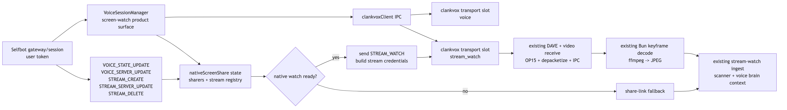

# Selfbot Stream Watch — Direct clankvox Integration Plan

Status: **watch path complete** — native stream watch validated end-to-end on March 13, 2026

Current product-level docs:

- [`../capabilities/media.md`](../capabilities/media.md)
- [`../voice/screen-share-system.md`](../voice/screen-share-system.md)
- [`../voice/discord-streaming.md`](../voice/discord-streaming.md)

This file remains useful as the implementation narrative and validation trail for
the direct-integration work, but it is no longer the primary product doc.

References:
- [`../voice/discord-streaming.md`](../voice/discord-streaming.md)
- [`../voice/screen-share-system.md`](../voice/screen-share-system.md)
- [`../voice/voice-provider-abstraction.md`](../voice/voice-provider-abstraction.md)
- [`../notes/NATIVE_SCREENSHARE_NOTES.md`](../notes/NATIVE_SCREENSHARE_NOTES.md)
- [`../operations/logging.md`](../operations/logging.md)
- [`Discord-video-stream`](https://github.com/Discord-RE/Discord-video-stream) — WebRTC-based Go Live send (reference protocol)
- [`Discord-video-selfbot`](https://github.com/aiko-chan-ai/Discord-video-selfbot) — older UDP-based Go Live send (useful transport evidence)



<!-- source: docs/diagrams/user-session-stream-watch-plan.mmd -->

## Goal

Enable `start_screen_watch` to watch Discord Go Live streams natively through
`clankvox` without relying on the share-link fallback.

The selfbot runs on a user token. It is already a user-session participant in the
voice channel. It can directly receive stream discovery dispatch, send
`STREAM_WATCH`, and open a stream-server media connection — no separate account
or gateway needed.

The end state is:

- one product capability: `start_screen_watch`
- one runtime tree: Bun app + `clankvox`
- one native receive pipeline: `clankvox` video receive -> Bun keyframe decode
  -> existing stream-watch ingest
- one fallback path: share-link capture remains the recovery transport

Implemented in the repo now:

- selfbot gateway patches and raw dispatch hooks
- stream discovery state for `VOICE_STATE_UPDATE.self_stream`, `STREAM_CREATE`,
  `STREAM_SERVER_UPDATE`, and `STREAM_DELETE`
- Bun-side `STREAM_WATCH` request wiring for native screen watch
- `clankvox` `stream_watch` IPC, second transport role, and role-aware
  `transport_state`
- `voiceStreamWatch` / session lifecycle integration that requests the stream,
  opens `clankvox` when credentials exist, and tears it down on stop/delete
- native transport failure now forces the share-link fallback directly instead
  of re-entering native selection

Validated live March 13, 2026:

- selfbot receives `STREAM_CREATE` / `STREAM_SERVER_UPDATE` after OP20 `STREAM_WATCH`
- stream server accepts modern UDP + DAVE watcher flow
- DAVE MLS E2EE handshake completes, video frames decrypt successfully
- H264 depacketization + Annex-B normalization + ffmpeg decode produces valid JPEG
- stream-watch brain context pipeline receives decoded frames and produces commentary
- two-checkpoint link fallback suppression prevents duplicate transports when native watch is active

Still open:

- RTX retransmission receive for packet-loss recovery
- outbound native stream send

This plan assumes personal experimentation in a private server.

## Non-Goals

- teaching the model a second tool or transport-specific capability
- removing the share-link fallback
- building a full smooth video player UI inside the selfbot runtime

The native path remains a screen-watch context feature, not a full remote
desktop product.

## Product Contract

The autonomy contract does not change:

- the model still only sees `start_screen_watch`
- runtime still decides transport
- active sharers remain context, not automatic visibility
- the agent can still choose silence after it starts watching

## Why Direct Integration

We already have most of the expensive lower-half work in place:

- H264/VP8 receive
- DAVE video decrypt
- remote video state tracking
- OP15 media sink wants
- keyframe decode to JPEG
- stream-watch ingest, scanner notes, and commentary

The biggest missing gap is not visual reasoning. It is stream discovery plus a
second media connection for the stream-server leg.

Since the selfbot is already a user-session participant, we skip the entire
"how do we get a user session into the channel" problem. Direct integration:

- reuses the existing `clankvox` video plumbing instead of duplicating it
- keeps screen-watch state in the existing voice session runtime
- keeps logs, tests, and failure handling in the main repo
- avoids a temporary architecture we would later have to delete

## Reference Takeaways

The two external reference repos are useful, but they prove different things:

- `Discord-video-stream`
  - useful for modern Go Live control-plane shape
  - shows `rtc_server_id` used as the stream connection `server_id`
  - shows `READY.d.streams[]` is the important source of stream SSRC metadata
  - does not implement watch / receive
- `Discord-video-selfbot`
  - useful as evidence that a stream connection can follow the same broad
    voice-WS + UDP handshake pattern as regular voice
  - shows the stream leg reuses the main voice `session_id`
  - does not implement watch / receive
  - predates modern AEAD + DAVE handling and uses older `xsalsa20_*` modes

Working conclusion:

- UDP is the right first transport to try for `stream_watch`
- WebRTC is no longer the leading risk, but is still a fallback contingency
- receive-side SSRC and payload-type mapping must stay runtime-derived
- watcher-side OP12 announcements must not synthesize missing `READY.d.streams[]`
  metadata
- modern receive-side stream watch remains unproven until live validation

## Key Design Decision

Direct integration does not mean forcing every concern into `clankvox`.

Planned split:

- Bun owns Discord control-plane concerns:
  - user-token gateway session (the selfbot's own session)
  - stream discovery dispatch handling
  - mapping Discord stream events into session intent
- `clankvox` owns media-plane concerns:
  - voice transport (audio send/receive, music, TTS, speaking state)
  - stream-server video transport (Go Live receive)
  - DAVE, RTP, depacketization, OP15, IPC video events

This keeps `clankvox` focused on transport/media while still making it the
native owner of the stream watch path.

## Target Architecture

### High-level shape

The integrated design has two transport roles:

1. `voice`
   - the selfbot's voice connection to the channel
   - audio send/receive, music, TTS, speaking state
2. `stream_watch`
   - stream-server connection for Go Live video receive
   - receives Go Live video metadata and frames

Both connections use the same user identity (user id, session id) since the
selfbot is a single account. The stream-server connection uses stream-specific
credentials from `STREAM_SERVER_UPDATE`.

### Why two transport roles instead of one

The voice connection and the stream-server connection are distinct Discord
media connections with different endpoints, tokens, and server ids. They must
be modeled as separate transport slots in `clankvox` so that:

- stream transport disconnect does not tear down the voice session
- each has its own DAVE manager and reconnect lifecycle
- audio behavior stays attached only to the voice role
- video subscriptions stay attached only to the stream watch role

## Runtime Flow

### 1. Voice session begins

- selfbot joins VC via its gateway session
- stream discovery dispatch is already available on the selfbot's gateway

### 2. Go Live discovery

The selfbot's gateway session receives dispatch and records:

- `VOICE_STATE_UPDATE` with `self_stream`
- `STREAM_CREATE`
- `STREAM_SERVER_UPDATE`
- `STREAM_DELETE`

This updates native sharer metadata in the active voice session.

### 3. Screen watch request

When runtime resolves `start_screen_watch`:

- choose the target sharer as today
- if a native sharer is active, send `STREAM_WATCH` via gateway
- on `STREAM_CREATE` + `STREAM_SERVER_UPDATE`, forward stream credentials into
  `clankvox`
- `clankvox` opens the `stream_watch` transport

### 4. Frame receive

The stream connection:

- identifies against the stream server with the selfbot's credentials
- receives OP12 / OP18 video state
- sends OP15 media sink wants
- receives encrypted video RTP
- DAVE decrypts and depacketizes video
- emits `video_state` / `video_frame` / `video_end`

Node then:

- decodes sampled keyframes to JPEG with the existing `ffmpeg` path
- feeds them into `ingestStreamFrame`
- preserves the existing scanner + commentary behavior

### 5. Teardown

Native watch tears down on:

- `STREAM_DELETE`
- target leaving VC
- selfbot leaving VC
- stream transport disconnect
- explicit stop watch

If the native path cannot start or becomes unhealthy, runtime falls back to the
existing share-link path.

## Direct Integration Plan

### Milestone 1: Prepare the runtime model for multiple transport roles

This is the first change because the current Rust state model is still
single-connection.

Current state in `clankvox`:

- one pending connection tuple
- one `voice_conn`
- one reconnect loop
- one DAVE manager
- one disconnect path that assumes all media is the primary voice connection

That is incompatible with stream watch.

Refactor target:

- introduce `TransportRole`
  - `Voice`
  - `StreamWatch`
- replace singleton connection fields with role-scoped transport slots
- make `VoiceEvent` role-aware so stream transport disconnect does not tear down
  the voice session
- keep audio/mixer behavior attached only to `Voice`
- keep stream-watch video subscriptions and remote video state attached only to
  `StreamWatch`

Recommended shape in Rust:

```rust
enum TransportRole {
    Voice,
    StreamWatch,
}

struct TransportSlot {
    role: TransportRole,
    pending: PendingConnection,
    conn: Option<VoiceConnection>,
    dave: Arc<Mutex<Option<DaveManager>>>,
    reconnect_deadline: Option<Instant>,
    reconnect_attempt: u32,
}
```

This avoids a second wave of cleanup later.

### Milestone 2: Generalize `VoiceConnection::connect`

The current connection API is regular-voice-specific. Stream watch should not
be expressed as boolean branches hanging off guild/channel fields.

Refactor the connection params around explicit transport inputs:

```rust
pub struct VoiceConnectionParams<'a> {
    pub endpoint: &'a str,
    pub server_id: &'a str,
    pub user_id: u64,
    pub session_id: &'a str,
    pub token: &'a str,
    pub dave_channel_id: u64,
    pub role: TransportRole,
    pub identify_streams: &'a [IdentifyStream],
    pub speaking_mode: Option<u32>,
}
```

Important consequences:

- `server_id` becomes explicit instead of assumed from guild id
- `dave_channel_id` becomes explicit instead of assumed from channel id
- identify payload construction becomes role-driven
- stream watch stops pretending it is a normal guild voice connection

### Milestone 3: Wire stream discovery through the selfbot gateway

The selfbot already has a gateway session. Extend it to track stream dispatch:

- receive stream-related dispatch:
  - `VOICE_STATE_UPDATE` with `self_stream`
  - `STREAM_CREATE`
  - `STREAM_SERVER_UPDATE`
  - `STREAM_DELETE`
- send gateway opcodes:
  - OP20 `STREAM_WATCH`
  - OP22 `STREAM_SET_PAUSED` when needed

This is not a new module — it extends the existing selfbot gateway handling to
capture stream events and expose them to the voice session runtime.

### Milestone 4: Extend session state and native sharer tracking

Extend `VoiceSessionNativeScreenShareState` in:

- `src/voice/voiceSessionTypes.ts`
- `src/voice/nativeDiscordScreenShare.ts`

Add stream-watch runtime state:

- active stream-key registry
- pending target stream key
- latest `rtc_server_id`
- latest stream endpoint/token receipt time
- stream transport connection state
- failure classification for fallback

This state must be visible to:

- target resolution
- native watch eligibility
- operational messaging
- realtime instruction refresh
- dashboard/runtime snapshots

### Milestone 5: Add new IPC commands for stream-watch transport

Extend:

- `src/voice/clankvoxClient.ts`
- `src/voice/clankvox/src/ipc_protocol.rs`
- `src/voice/clankvox/src/ipc.rs`

Recommended commands:

- `stream_watch_connect`
- `stream_watch_disconnect`

Recommended payload for `stream_watch_connect`:

```json
{
  "type": "stream_watch_connect",
  "endpoint": "<stream endpoint>",
  "token": "<stream token>",
  "serverId": "<rtc_server_id>",
  "sessionId": "<selfbot session id>",
  "userId": "<selfbot user id>",
  "daveChannelId": "<derived dave channel id>"
}
```

Recommended output events:

- `transport_state`
  - include `role`
  - include `status`
  - include `reason`
- keep legacy `connection_state` only for the primary voice transport until the
  Bun session lifecycle fully migrates to `transport_state`

Do not add stream-watch-only bespoke state messages when a role-aware transport
state envelope is enough.

### Milestone 6: Implement role-aware disconnect and reconnect handling

This is mandatory. Without it, stream-watch failures will incorrectly collapse
the voice session.

Behavior target:

- `voice` disconnect
  - current reconnect and session-failure behavior stays
- `stream_watch` disconnect
  - stop native watch
  - preserve voice session
  - classify the failure for possible share-link fallback

All reconnect scheduling and cleanup functions in `clankvox` should become
role-scoped.

### Milestone 7: Parse stream-server `READY` correctly

The current implementation already parses remote OP12 / OP18 video state well,
but the stream-server handshake still assumes regular-voice shape.

Required changes:

- parse `READY.d.streams[]`
- treat `streams[].ssrc` and `streams[].rtx_ssrc` as canonical stream-watch
  SSRCs
- keep top-level `video_ssrc` parsing only as a compatibility path
- normalize the chosen stream descriptors into the existing video state model

This change should happen in:

- `src/voice/clankvox/src/voice_conn.rs`

### Milestone 8: Make DAVE explicitly role-specific

Do not share one DAVE manager across voice and stream watch.

Required changes:

- one DAVE manager per transport slot
- explicit DAVE channel id input
- explicit user id per slot

Expected DAVE derivation:

- `voice`: current channel-based behavior
- `stream_watch`: derived from `rtc_server_id`

If live validation confirms `BigInt(rtc_server_id) - 1` semantics, encode that
derivation in one well-named helper instead of sprinkling it through the call
sites.

### Milestone 9: Stream transport protocol — UDP-first path strongly supported

`Discord-video-selfbot` significantly reduces the stream-transport uncertainty.
It shows an older sender-side Go Live stream connection using
`protocol: "udp"` with the same broad handshake shape as regular voice:

- IP discovery
- OP1 `SELECT_PROTOCOL`
- OP4 `SESSION_DESCRIPTION`

That is strong evidence that `clankvox` should attempt a direct UDP stream-watch
transport first instead of starting with a WebRTC stack.

Reference evidence (`Discord-video-selfbot/src/Class/BaseConnection.ts`):

- `selectProtocols()` sends `{ protocol: "udp", data: { address, port, mode } }`
- `StreamConnection extends BaseConnection` — inherits the same UDP handshake
- `STREAM_CREATE` fills the stream connection's `serverId` from `rtc_server_id`
- the stream connection reuses the main voice `session_id`
- encryption is `xsalsa20_poly1305_lite` and voice version is 7

What this reference does prove:

- a Discord stream leg can exist as a second media connection
- that leg can use a voice-style UDP handshake instead of requiring WebRTC
- `rtc_server_id` and the session id are the important identity inputs

What this reference does not prove:

- that modern `STREAM_WATCH` transport still behaves the same
- that modern v9 + AEAD + DAVE stream servers accept the same mode set
- that receive-side video SSRCs can be inferred as `ssrc + 1` / `ssrc + 2`
- that inbound frames arrive on the modern stack

This means:

- **UDP should be the first implementation path.** We should try the existing
  `clankvox` transport model, generalized for the stream-watch role, before
  spending time on WebRTC.
- **WebRTC remains a contingency, not a baseline assumption.** The sender-side
  WebRTC approach in `Discord-video-stream` is not enough reason to build a full
  WebRTC stack first.
- **Receive-side metadata stays negotiated.** Treat `READY.d.streams[]` and
  advertised codecs as canonical. Do not hardcode sender-side `ssrc + 1`
  conventions.
- **DAVE and encryption still need live confirmation.** The reference predates
  DAVE entirely, so `clankvox` must derive channel IDs and select modern modes
  from what the stream server actually advertises.

Remaining validation:

- confirm `STREAM_WATCH` produces a modern stream-server credential flow
- confirm the stream server advertises and accepts `clankvox`'s modern AEAD
  mode set
- confirm DAVE channel ID derivation (`BigInt(rtc_server_id) - 1`) works
- confirm video frames arrive over the UDP path using modern v9 semantics

### Milestone 10: WebRTC fallback (contingency only)

Keep this milestone in the plan as insurance, but it is now low-priority. If
live testing reveals that modern Discord stream servers have moved to
WebRTC-only since the `Discord-video-selfbot` library was last updated, the
fallback plan remains:

- keep `voice` on the existing transport
- implement WebRTC only for `stream_watch`
- keep the output of that path normalized into the existing video events

The product should not care whether the transport underneath is UDP or WebRTC.

### Milestone 11: Wire native watch start/stop through the existing screen-watch surface

Update:

- `src/bot/screenShare.ts`
- `src/voice/voiceStreamWatch.ts`
- `src/voice/sessionLifecycle.ts`
- `src/voice/instructionManager.ts`

Behavior target:

- native watch eligibility depends on stream discovery state and transport
  readiness
- explicit target selection still works as today
- ambiguous multi-sharer handling still stays conservative
- transport failure can force share-link fallback without retrying native first
- fallback to share-link remains intact

Do not add transport-specific model tools.

## File-by-File Plan

### Bun / TypeScript

- `src/app.ts`
  - ensure stream discovery is wired into the selfbot gateway lifecycle
- `src/config.ts`
  - add env parsing for stream-watch feature toggles
- `src/voice/nativeDiscordScreenShare.ts`
  - extend state normalization and target resolution with stream-key state
- `src/voice/voiceSessionTypes.ts`
  - add stream-watch transport-state fields
- `src/voice/sessionLifecycle.ts`
  - subscribe to stream discovery events
  - map stream creation/update/delete into IPC commands and native state
- `src/voice/clankvoxClient.ts`
  - add new IPC commands and role-aware transport-state events
- `src/bot/screenShare.ts`
  - native-first eligibility now includes stream discovery readiness
- `src/voice/voiceStreamWatch.ts`
  - keep existing watch behavior, but use improved failure/fallback reasons

### Rust / clankvox

- `src/voice/clankvox/src/ipc_protocol.rs`
  - add stream-watch connection commands
- `src/voice/clankvox/src/ipc.rs`
  - parse and emit role-aware transport messages
- `src/voice/clankvox/src/app_state.rs`
  - replace singleton connection state with role-scoped transport slots
- `src/voice/clankvox/src/connection_supervisor.rs`
  - role-aware connect / reconnect / teardown
- `src/voice/clankvox/src/voice_conn.rs`
  - generalize connect params
  - role-aware identify and DAVE setup
  - parse `READY.d.streams[]`
  - optionally support stream-role WebRTC later
- `src/voice/clankvox/src/capture_supervisor.rs`
  - consume role-aware video events cleanly
  - preserve existing subscription/media-sink logic
- `src/voice/clankvox/src/dave.rs`
  - ensure separate DAVE lifecycle per transport slot

## Observability Plan

Add explicit logs for every important control-plane and media-plane edge.

Suggested action names:

- `stream_discovery_dispatch`
- `stream_watch_requested`
- `stream_create_received`
- `stream_server_received`
- `stream_delete_received`
- `stream_watch_transport_connect_start`
- `stream_watch_transport_connected`
- `stream_watch_transport_failed`
- `stream_watch_transport_disconnected`
- `stream_watch_transport_protocol_rejected`
- `stream_watch_native_fallback_started`

Suggested Rust tracing events:

- `clankvox_transport_connect_start`
- `clankvox_transport_ready`
- `clankvox_transport_reconnect_scheduled`
- `clankvox_transport_disconnected`
- `clankvox_stream_ready_streams_parsed`
- `clankvox_stream_dave_initialized`

The logs should always include:

- `sessionId`
- `guildId`
- `targetUserId`
- `streamKey`
- `transportRole`
- `endpointHost` when safe
- close code / failure reason

## Testing Plan

### TypeScript tests

- stream discovery dispatch parsing for `VOICE_STATE_UPDATE`, `STREAM_CREATE`,
  `STREAM_SERVER_UPDATE`, `STREAM_DELETE`
- native eligibility and target selection with stream discovery state
- fallback behavior when stream transport is unavailable

### Rust tests

- role-aware connection slot lifecycle
- `READY.d.streams[]` parsing
- role-aware disconnect handling
- role-aware DAVE channel selection
- IPC parsing for new stream-watch commands

### Integration tests

- stream discovery -> `clankvoxClient` -> `sessionLifecycle`
- stream start / stream delete / fallback transitions
- ensure stream transport failure does not end the voice session

### Live validation checklist

Manual validation should prove, in order:

1. selfbot receives stream discovery dispatch in VC
2. `STREAM_WATCH` yields stream credentials
3. `clankvox` opens the stream transport
4. first `video_state` arrives
5. first keyframe decodes to JPEG
6. `ingestStreamFrame` accepts it
7. stream end tears down cleanly without affecting voice session

## Risk Register

### 1. Stream transport may require WebRTC — risk reduced, not removed

~~This was the largest remaining engineering risk.~~

`Discord-video-selfbot` shows an older sender-side stream connection using
`protocol: "udp"` with the same broad handshake shape as regular voice. That
significantly de-risks the plan. The remaining uncertainty is whether modern
stream servers on v9 + AEAD + DAVE still accept the same approach. Live testing
in Milestone 9 will confirm.

### 2. Discord ToS and account safety

This plan assumes a selfbot used only for private experimentation in a personal
server.

## Rollout Sequence

Recommended implementation order:

1. stream discovery wiring through selfbot gateway (Milestone 3)
   - validates whether `STREAM_WATCH` works at all
   - if this fails, the entire plan changes — test the riskiest assumption first
2. session-state wiring (Milestone 4)
3. `clankvox` transport-role refactor (Milestones 1, 2)
4. IPC commands for stream-watch transport (Milestone 5)
5. role-aware disconnect, READY parsing, DAVE (Milestones 6, 7, 8)
6. stream-role connection attempt over UDP (Milestone 9)
7. end-to-end native watch validation
8. stream-role WebRTC only if UDP fails (Milestone 10)
9. wire native watch through screen-watch surface (Milestone 11)
10. dashboard/runtime snapshot polish
11. canonical doc cleanup after the implementation stabilizes

## Product Language

Prefer:

- "native screen watch"
- "stream watch transport"
- "stream discovery"

Avoid:

- exposing transport details to the model
- implying native watch is always available

User-facing product language should stay:

- "start screen watch"
- "watch your screen"
- "native screen watch when available"
