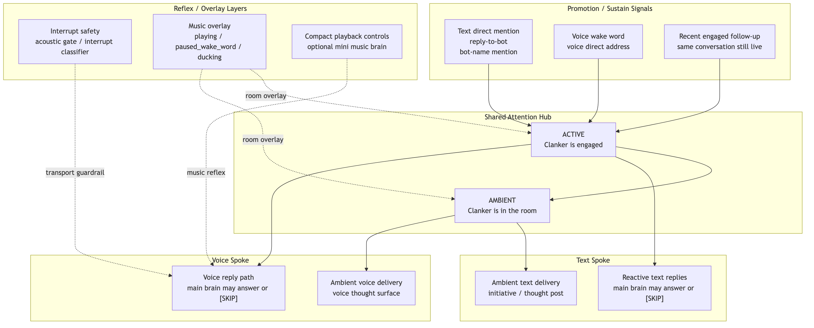
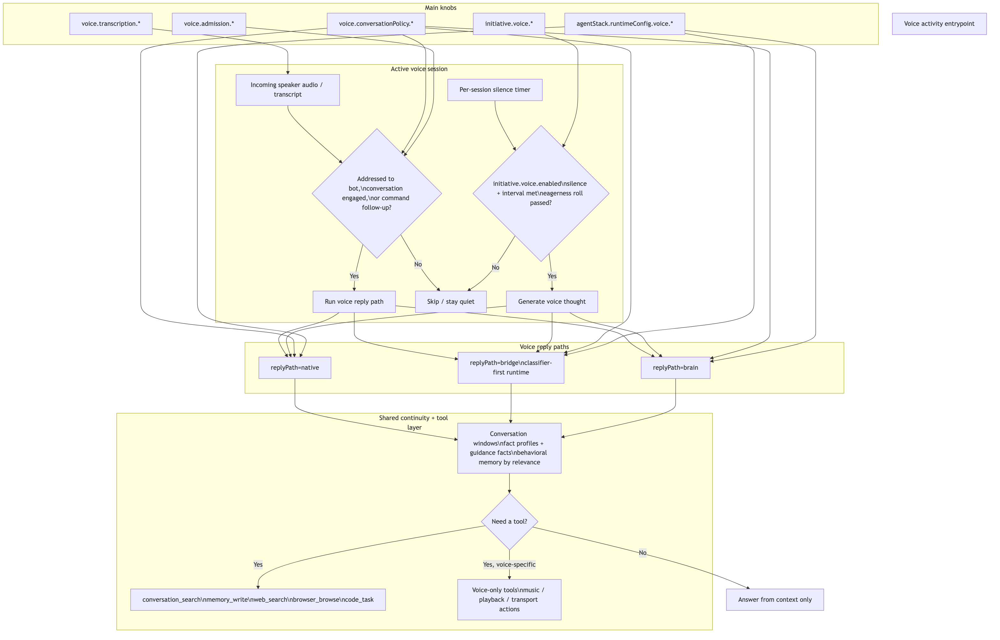

# Clanker Activity Model

> **Scope:** Current shipped mapping from the shared attention model into text and voice behavior.
> Shared attention model: [`presence-and-attention.md`](presence-and-attention.md)
> Unified text initiative cycle: [`initiative-unified-spec.md`](initiative-unified-spec.md)
> Voice pipeline and stage settings: [`voice/voice-provider-abstraction.md`](voice/voice-provider-abstraction.md)
> Architecture overview: [`technical-architecture.md`](technical-architecture.md)

This document is the source of truth for how the current runtime surfaces one shared conversational attention model through text and voice. It documents the shipped spokes and guardrails, not a giant transport-level finite-state machine.

### Autonomy Principle

Settings shape context, budgets, and transport. They do not script the bot's creative behavior. Admission gates are cost/noise gates, not relevance gates. The model can always choose silence through `[SKIP]`, and tools are capabilities it may use when they help.

<!-- source: docs/diagrams/clanker-activity.mmd -->

<!-- source: docs/diagrams/clanker-voice-and-tools.mmd -->

## Mental Model

The canonical behavioral picture is:

- one shared attention hub with `ACTIVE` and `AMBIENT`
- a text spoke that decides how attention surfaces in channels
- a voice spoke that decides how attention surfaces in VC
- orthogonal overlays such as music playback, wake latch, and assistant output lock

What is currently shipped under that model:

Text has four shipped surfaces:

1. `Directly addressed reply`
2. `Recent-window follow-up reply`
3. `Cold ambient reactive reply`
4. `Unified initiative cycle`

Voice has four shipped surfaces:

1. `Directed or engaged voice reply`
2. `Voice admission and floor ownership`
3. `Voice thought engine`
4. `Tool-assisted reply inside the active turn`

Discovery feed items are optional context inside the ambient text surface. Music playback is an overlay on top of attention, not a third attention mode.

## Text Activity Paths

### 1. Directly Addressed Reply

This is the clearest text-side promotion into `ACTIVE`.

Triggers include:

- the user mentions the bot
- the user replies to a bot message
- the user clearly uses the configured bot name or alias

Behavior:

- the message enters the reply pipeline immediately
- direct address promotes conversational attention, but it does not mark the turn as response-required
- the model still decides the exact reply or `[SKIP]`
- global blockers still apply, including permissions, rate limits, cooldowns, and runtime failures

Main settings:

- `permissions.replies.allowReplies`
- `interaction.activity.minSecondsBetweenMessages`
- `interaction.activity.replyCoalesceWindowSeconds`

Direct address bypasses the ambient and response-window admission gates. Those knobs still shape prompt context, but they do not decide whether an explicitly addressed turn enters the reply pipeline.

Startup catchup reuses this same direct-address path for missed addressed turns after downtime. It replays those turns into the normal decision loop rather than forcing a guaranteed reply.

Relevant code:

- `src/bot/replyAdmission.ts`
- `src/bot/replyPipeline.ts`
- `src/prompts/promptText.ts`

### 2. Recent-Window Follow-Up Reply

If the bot already has a message in the recent channel window, later non-addressed turns can still enter reply admission as a follow-up. This is the text spoke's current shipped version of sustained `ACTIVE` attention.

Behavior:

- this is still a reactive reply path, not initiative
- `permissions.replies.allowUnsolicitedReplies` still matters
- `interaction.activity.responseWindowEagerness` controls how sticky the recent-engagement window is
- the model can still `[SKIP]`

Relevant code:

- `src/bot/replyAdmission.ts`
- `src/bot/replyPipeline.ts`
- `src/prompts/promptText.ts`

### 3. Cold Ambient Reactive Reply

If there is no recent thread to continue, the bot can still consider a non-addressed text reply as an ambient chime-in. This is a reactive ambient surface, not an engaged-thread surface.

Behavior:

- this is separate from both direct address and recent-window follow-ups
- `interaction.activity.ambientReplyEagerness` is the admission dial for these cold reactive turns
- the model still decides whether to reply or `[SKIP]`

Relevant code:

- `src/bot/replyAdmission.ts`
- `src/bot/replyPipeline.ts`
- `src/prompts/promptText.ts`

### 4. Unified Initiative Cycle

This is the cold-start ambient text surface. It handles both conversational chime-ins and standalone proactive posts.

Behavior:

- runs on an in-process 60 second tick
- applies deterministic gates first: enabled, cooldown, daily cap, and eagerness probability
- builds context for eligible channels, passive discovery feed items, source performance, and memory
- gives the model a bounded tool loop
- the model decides whether to post, which channel fits, whether to use tools, whether to include links, and whether to request media

Canonical channel pool:

- `permissions.replies.replyChannelIds`

`initiative.discovery.*` controls feed and media infrastructure for the same ambient cycle.

Main settings:

- `initiative.text.enabled`
- `initiative.text.eagerness`
- `initiative.text.minMinutesBetweenPosts`
- `initiative.text.maxPostsPerDay`
- `initiative.text.lookbackMessages`
- `initiative.text.allowActiveCuriosity`
- `initiative.text.maxToolSteps`
- `initiative.text.maxToolCalls`
- `initiative.discovery.*`

Relevant code:

- `src/bot/initiativeEngine.ts`
- `src/services/discovery.ts`
- `src/prompts/promptText.ts`
- `src/store/settingsNormalization.ts`

## Voice Activity Paths

### 1. Directed Or Engaged Voice Reply

Voice behavior runs only inside an active voice session. The reply path considers direct address, command follow-up state, speaker ownership, recent room context, and output locking. This is the main voice-side `ACTIVE` surface.

Behavior:

- deterministic gates run first
- if the turn survives, the active reply path handles generation
- the generation layer decides the actual words or silence

Main settings:

- `voice.enabled`
- `voice.conversationPolicy.ambientReplyEagerness`
- `interaction.activity.responseWindowEagerness`
- `interaction.activity.reactivity`
- `voice.soundboard.eagerness`
- `voice.conversationPolicy.commandOnlyMode`
- `voice.conversationPolicy.replyPath`
- `voice.admission.mode`
- `voice.admission.musicWakeLatchSeconds`

Relevant code:

- `src/voice/voiceReplyDecision.ts`
- `src/voice/turnProcessor.ts`
- `src/voice/voiceConfigResolver.ts`

### 2. Voice Admission Gate

Voice admission is not a separate mind. It is the voice spoke's cost/floor gate on top of shared attention.

Voice admission currently has two layers:

1. deterministic gates
2. classifier or generation-owned skip behavior, depending on reply path

Current public surface:

- `voice.admission.mode`
- `voice.admission.musicWakeLatchSeconds`
- `agentStack.overrides.voiceAdmissionClassifier`

Runtime behavior:

- `bridge` reply path always behaves as classifier-first, because the text-to-realtime bridge has no native `[SKIP]`
- `brain` reply path defaults to `generation_decides`
- `native` reply path does not use the text classifier path
- internal runtime labels like `hard_classifier` and `generation_only` are implementation details, not canonical settings names

Relevant code:

- `src/voice/voiceReplyDecision.ts`
- `src/settings/agentStack.ts`

### 3. Voice Thought Engine

This is the ambient voice surface. It runs only while a voice session is active and the room is quiet enough.

Behavior:

- gated by silence and spacing, not by a global cron
- eagerness is a probability gate before generation
- even after the gate passes, the generated thought can still be rejected or skipped
- delivery uses the active voice output transport

Canonical cadence settings:

- `initiative.voice.enabled`
- `initiative.voice.eagerness`
- `initiative.voice.minSilenceSeconds`
- `initiative.voice.minSecondsBetweenThoughts`

Implementation note:

- the live thought generator currently resolves its provider/model from the orchestrator binding during generation

Relevant code:

- `src/voice/thoughtEngine.ts`
- `src/voice/voiceThoughtGeneration.ts`
- `src/settings/agentStack.ts`

### 4. Voice Runtime Modes

Voice uses three reply-path shapes under the same attention model:

- `native`: provider-native audio in and audio out
- `bridge`: local transcription, then labeled text into the realtime provider
- `brain`: orchestrator-owned text generation, then realtime or API TTS delivery

The operator-facing knobs are:

- `voice.conversationPolicy.replyPath`
- `voice.conversationPolicy.ttsMode`
- `agentStack.runtimeConfig.voice.runtimeMode`
- `agentStack.runtimeConfig.voice.generation`

## Channel Scope Rules

### Text Scope

Reactive replies and ambient text delivery both respect the text permission surfaces:

- `permissions.replies.replyChannelIds`
- `permissions.replies.allowedChannelIds`
- `permissions.replies.blockedChannelIds`
- `permissions.replies.blockedUserIds`

`replyChannelIds` is the unified initiative pool. If it is empty, the initiative cycle has no eligible text channels.

### Voice Scope

Voice session eligibility is controlled separately. Shared attention can span text and voice in the same social context, but transport access is still modality-specific:

- `voice.channelPolicy.allowedChannelIds`
- `voice.channelPolicy.blockedChannelIds`
- `voice.channelPolicy.blockedUserIds`
- `voice.sessionLimits.*`

Text channel permissions do not determine which voice channels the bot may join.

## Setting Map

### Shared Activity Axes

| Surface | What it controls |
|---|---|
| `interaction.activity.ambientReplyEagerness` | Cold ambient text replies when there is no direct address or active follow-up thread |
| `interaction.activity.responseWindowEagerness` | How sticky shared recent engagement is for text and voice follow-up replies |
| `interaction.activity.reactivity` | Shared quick reactions such as emoji responses and other lightweight acknowledgements |
| `voice.conversationPolicy.ambientReplyEagerness` | Ambient voice replies when the bot is in VC but not directly addressed |

### Text Reply Controls

| Surface | What it controls |
|---|---|
| `permissions.replies.allowReplies` | Global text reply master switch |
| `permissions.replies.allowUnsolicitedReplies` | Whether non-addressed reactive follow-up replies may enter admission |
| `interaction.activity.minSecondsBetweenMessages` | Global spacing between bot text messages |

### Text Initiative Controls

| Surface | What it controls |
|---|---|
| `initiative.text.enabled` | Master switch for ambient text delivery |
| `initiative.text.eagerness` | Probability gate before the ambient text LLM call |
| `initiative.text.minMinutesBetweenPosts` | Minimum gap between ambient text considerations |
| `initiative.text.maxPostsPerDay` | Daily ambient text budget |
| `initiative.text.lookbackMessages` | Per-channel context window size |
| `initiative.text.allowActiveCuriosity` | Whether `web_search` and `browser_browse` are available |
| `initiative.text.maxToolSteps` / `initiative.text.maxToolCalls` | Ambient text tool-loop budgets |
| `initiative.discovery.*` | Passive feed collection, source curation, and media budgets |

### Voice Controls

| Surface | What it controls |
|---|---|
| `voice.conversationPolicy.commandOnlyMode` | Restricts voice behavior toward commands and explicit wakeups |
| `voice.conversationPolicy.replyPath` | `native`, `bridge`, or `brain` |
| `voice.conversationPolicy.ttsMode` | Realtime or API TTS output for brain path |
| `voice.admission.mode` | Public voice-side admission surface |
| `voice.admission.musicWakeLatchSeconds` | Follow-up wake window during music playback |
| `voice.soundboard.eagerness` | How readily the bot uses Discord soundboard beats when they fit |
| `voice.transcription.*` | ASR enablement and language hinting |
| `voice.sessionLimits.*` | Session duration and concurrency limits |
| `agentStack.runtimeConfig.voice.*` | Provider/runtime-specific transport and generation config |
| `initiative.voice.*` | Ambient voice thought cadence |

## Tool Calling Model

Text and voice share most of the same conversational tool surface, but voice keeps durable-memory search automatic rather than model-invoked. The tools are capabilities the model may choose when they help.

Shared tools include:

- `conversation_search`
- `memory_write`
- `web_search`
- `browser_browse`
- `code_task`

Text-only shared tool:

- `memory_search`

Voice-only or voice-centric tools include:

- `music_*`
- session transport / leave actions
- provider-native realtime function calls

Relevant code:

- `src/tools/replyTools.ts`
- `src/voice/voiceToolCalls.ts`
- `src/voice/voiceToolCallDispatch.ts`

## Defaults Worth Remembering

Base initiative defaults from `settingsSchema.ts`:

- `interaction.activity.ambientReplyEagerness = 20`
- `interaction.activity.responseWindowEagerness = 55`
- `interaction.activity.reactivity = 40`
- `voice.conversationPolicy.ambientReplyEagerness = 50`
- `initiative.text.enabled = true`
- `initiative.text.eagerness = 20`
- `initiative.text.minMinutesBetweenPosts = 360`
- `initiative.text.maxPostsPerDay = 3`
- `initiative.voice.enabled = true`
- `initiative.voice.eagerness = 50`
- `initiative.voice.minSilenceSeconds = 45`
- `initiative.voice.minSecondsBetweenThoughts = 60`

Base voice defaults from `settingsSchema.ts`:

- `voice.conversationPolicy.replyPath = "brain"`
- `voice.conversationPolicy.ttsMode = "realtime"`
- `voice.admission.mode = "generation_decides"`
- `voice.soundboard.eagerness = 40`

Preset resolution can override parts of the effective voice runtime, so the active preset still matters.

## Source Files

- `src/bot/replyAdmission.ts`
- `src/bot/replyPipeline.ts`
- `src/bot/initiativeEngine.ts`
- `src/services/discovery.ts`
- `src/voice/voiceReplyDecision.ts`
- `src/voice/thoughtEngine.ts`
- `src/voice/voiceThoughtGeneration.ts`
- `src/voice/voiceConfigResolver.ts`
- `src/prompts/promptText.ts`
