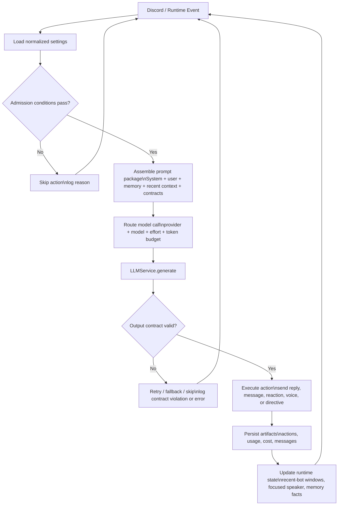
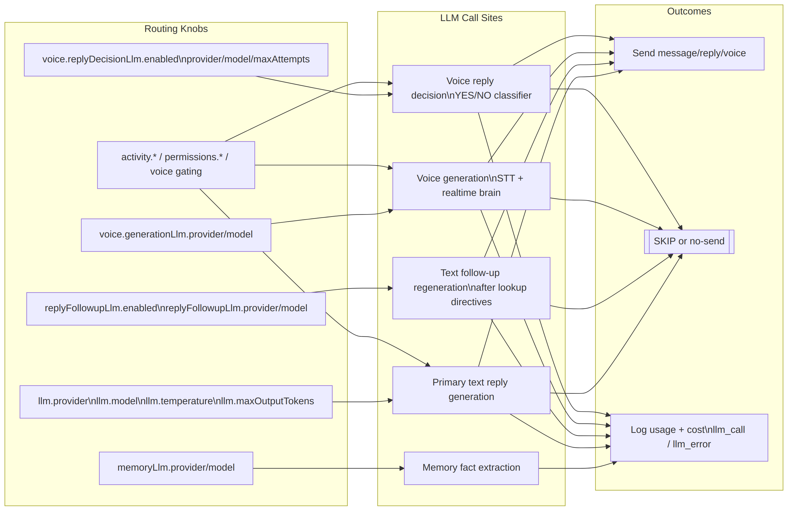

# LLM Orchestration Mental Model

The system is best understood as **conditional prompt engineering plus model routing**.

Key distinction: "weights" in this system refer to runtime **routing/policy knobs** (provider, model, effort, token budget, gates), not neural-network training weights.

## 1. Mental Model in One Line

**Event in -> conditions decide whether to call an LLM -> knobs decide which prompt/model stack runs -> output contracts decide what action is taken.**

## 2. Control Loop

<!-- source: docs/diagrams/llm-orchestration-control-loop.mmd -->

This loop repeats for text replies, voice turns, initiative posts, memory extraction, and follow-up regeneration passes.

## 3. Routing Knobs ("Weights")

<!-- source: docs/diagrams/llm-orchestration-routing-map.mmd -->

High-impact knobs:
- `llm.*`: primary text generation route.
- `replyFollowupLlm.*`: optional second-pass generation after lookup/tool directives.
- `memoryLlm.*`: durable fact extraction route.
- `voice.generationLlm.*`: voice response generation route (STT/realtime-brain paths).
- `voice.replyDecisionLlm.*`: voice YES/NO classifier route for ambiguous turns.
- `activity.*`, `permissions.*`, and voice gating settings: admission and pacing conditions.

## 4. Conditions That Gate Prompt Outcomes

The system uses two layers of conditions:

1. **Admission conditions** (should we even run a model call?):
- Text admission: `shouldAttemptReplyDecision(...)` in `src/bot/replyAdmission.ts`.
- Voice admission: `evaluateVoiceReplyDecision(...)` in `src/voice/voiceSessionManager.ts`.

2. **Post-admission output contracts** (if called, what counts as send vs skip?):
- Text generation supports explicit `[SKIP]` contract for non-required turns.
- Voice generation/classification has strict YES/NO or skip/empty handling depending on path.
- Invalid contract output becomes a controlled skip/retry/error path, not free-form undefined behavior.

## 5. Single-Source-of-Truth Files

- `src/settings/settingsSchema.ts`: default knob values.
- `src/store/settingsNormalization.ts`: clamping/normalization so knobs stay valid.
- `src/llm.ts`: provider/model routing, request execution, usage + cost logging.
- `src/pricing.ts`: per-provider/model pricing metadata used for cost accounting.
- `src/bot/replyAdmission.ts`: text admission conditions.
- `src/bot/queueGateway.ts`: queued dispatch and send-path policy.
- `src/voice/voiceSessionManager.ts`: voice admission + generation orchestration.

## 6. Practical Interpretation

The repo operates as a policy engine around model calls:
- Prompts define the policy surface.
- Settings define the routing weights.
- Conditions define the control logic.
- Outputs are contract-checked actions.

This mental model holds for day-to-day tuning and refactors.
