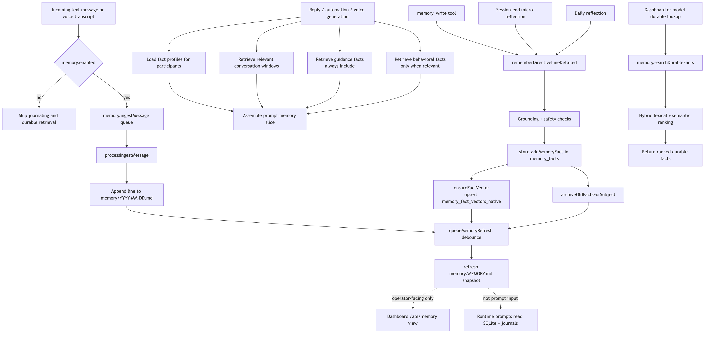

# Memory System (Source of Truth)

This document describes how durable memory works in runtime, based on current code behavior.

## Scope

Durable memory has two storage layers:

1. SQLite facts + vectors (used by runtime retrieval and prompts).
2. Markdown journals/snapshot files under `memory/` (operator-facing inspection).

Important: runtime prompts do **not** read `memory/MEMORY.md` directly. Prompt memory comes from SQLite retrieval.

## Flow Diagram

<!-- source: docs/diagrams/memory-system-flow.mmd -->

## Key Files

- `src/memory.ts`: ingestion queue, daily journaling, fact extraction, hybrid retrieval/ranking, markdown refresh.
- `src/store.ts`: `memory_facts` and `memory_fact_vectors_native` schema + query/update methods.
- `src/llm.ts`: memory fact extraction call + embedding API calls.
- `src/bot.ts`: message ingest, memory slice loading, memory lookup directives, lore-memory writes.
- `src/bot/voiceReplies.ts` and `src/voice/voiceSessionManager.ts`: voice transcript ingestion + memory context loading.
- `src/dashboard.ts`: `/api/memory`, `/api/memory/refresh`, `/api/memory/search`.

## Data Model

### `memory_facts` (durable facts)

Created in `Store.init()` (`src/store.ts`) with key fields:

- `guild_id` (required): primary scope boundary.
- `channel_id` (optional): retrieval bias, not hard partitioning.
- `subject` (required): user ID for user facts, or `__lore__` for lore facts.
- `fact`, `fact_type`, `evidence_text`, `source_message_id`, `confidence`.
- `is_active`: soft archive flag.
- `UNIQUE(guild_id, subject, fact)`: dedup/upsert key.

### `memory_fact_vectors_native` (semantic vectors)

- Primary key: `(fact_id, model)`.
- Stores `dims` and `embedding_blob` (Float32 blob).
- Queried with sqlite-vec cosine similarity (`1 - vec_distance_cosine(...)`).

## Runtime Lifecycle

### Startup and periodic maintenance

- `src/app.ts` initializes `MemoryManager` and calls `refreshMemoryMarkdown()` once at startup.
- `src/bot.ts` starts a 5-minute timer calling `refreshMemoryMarkdown()`.
- On shutdown, bot drains pending ingest jobs (`drainIngestQueue`) before exit.

### Message ingest pipeline (text chat)

Triggered in `ClankerBot.handleMessage()` when `settings.memory.enabled` is true:

1. `memory.ingestMessage(...)` queues a job keyed by `messageId`.
2. Queue behavior:
   - Dedupes concurrent same-message jobs by returning one shared promise.
   - Max queue length is `400`; overflow drops the oldest job and resolves it as `false`.
3. Worker runs `processIngestMessage(...)` sequentially:
   - Cleans content (trim/collapse, max 320 chars; empty/too short dropped).
   - Appends one line to `memory/YYYY-MM-DD.md`.
   - If content length >= 4 and guild scope exists, calls `llm.extractMemoryFacts(...)` (max 4 facts/message).
   - Normalizes and filters extracted facts, then upserts via `store.addMemoryFact(...)`.
   - Starts async embedding generation for inserted facts.
   - Archives older active facts for that user (`keep: 80`).
   - Schedules markdown refresh (`queueMemoryRefresh`, debounced by `pendingWrite` + 1s delay).

### Message ingest pipeline (voice transcripts)

Voice paths also feed durable memory using synthetic message IDs:

- `src/bot/voiceReplies.ts`: STT transcript ingest for voice turn generation.
- `src/voice/voiceSessionManager.ts`: realtime transcript ingest for realtime instruction context.

Both call `memory.ingestMessage(...)` with `trace.source` indicating voice pipeline origin.

### Explicit lore writes from reply directives

If model output includes `memoryLine`, bot calls `memory.rememberLine(...)`:

- Stored under subject `__lore__`.
- Fact text becomes `Memory line: <normalized line>.`
- `fact_type = "lore"`, `confidence = 0.72`.
- Archives lore to keep latest `120`.
- Triggers async embedding + markdown refresh.

This path is used in both text reply generation (`src/bot.ts`) and voice turn generation (`src/bot/voiceReplies.ts`).

## Extraction and Safety Guards

Fact extraction prompt lives in `LLMService.extractMemoryFacts(...)` and asks for durable, grounded facts only.

Post-extraction filters in `src/memory.ts` enforce:

- Fact normalization and length bounds.
- Fact type normalization (`preference|profile|relationship|project|other`; `general` collapses to `other`).
- Instruction/prompt-injection-like text rejection (`system`, `developer`, `ignore previous`, secrets, etc.).
- Grounding requirement (`isTextGroundedInSource`):
  - Exact compact-substring pass, or
  - token-overlap threshold (about 45% minimum, with short-line special case).
- Evidence accepted only if also grounded in source text.

If extraction/embedding fails, errors are logged and ingestion continues without crashing the message loop.

## Embeddings

Embeddings are used only for semantic ranking of facts:

- Query embedding: `llm.embedText(...)` when query length >= 3 and OpenAI client exists.
- Fact embedding payload includes `type`, `fact`, and optional `evidence`.
- Model resolution order:
  1. `settings.memory.embeddingModel`
  2. `appConfig.defaultMemoryEmbeddingModel` (`DEFAULT_MEMORY_EMBEDDING_MODEL` env)
  3. fallback `"text-embedding-3-small"`

If vectors are missing for some candidates, retrieval backfills up to 8 missing fact vectors per query.

## Retrieval and Ranking

### Prompt slice retrieval (`buildPromptMemorySlice`)

For normal response generation:

- `userFacts`: hybrid select for subject `[userId]`, limit 8.
- `relevantFacts`: hybrid select for subjects `[userId, "__lore__"]`, limit 10.
- `relevantMessages`: lexical search from `messages` table in current channel (limit 8).

Primary consumers of this slice:

- Text replies (`src/bot.ts`, `maybeReplyToMessage` path)
- Automation runs (`src/bot.ts`, automation generation path)
- Initiative generation (`src/bot.ts`, initiative post path)
- Voice turn generation/realtime voice context (`src/bot/voiceReplies.ts`, `src/voice/voiceSessionManager.ts`)

### Search API retrieval (`searchDurableFacts`)

For dashboard and model-triggered memory lookup:

- Pulls guild-scoped active facts (`getFactsForScope`).
- Hybrid ranking with strict relevance gate enabled.
- Returns top N (limit clamped to 1..24).

### Hybrid score formula

Per candidate:

- `lexicalScore`: token overlap / substring match on fact + evidence text.
- `semanticScore`: cosine similarity from sqlite-vec.
- `confidenceScore`: stored confidence.
- `recencyScore`: `1 / (1 + ageDays / 45)`.
- `channelScore`:
  - `1` same channel,
  - `0.25` fact has no channel_id,
  - `0` different channel.

Combined score:

- If semantic available:
  - `0.50 * semantic + 0.28 * lexical + 0.10 * confidence + 0.07 * recency + 0.05 * channel`
- If semantic unavailable:
  - `0.75 * lexical + 0.10 * confidence + 0.10 * recency + 0.05 * channel`

Relevance gate:

- With semantic: pass if semantic/lexical minimums are met, or strong combined score with minimum signal.
- Without semantic: requires lexical >= 0.24 or combined >= 0.62.
- Strict mode (`searchDurableFacts`) returns no hits if all candidates fail gate.

## Markdown Files in `memory/`

### Daily logs: `memory/YYYY-MM-DD.md`

- Append-only journal lines: timestamp, author, and scoped message text.
- Header is initialized once per day/file.

### Snapshot: `memory/MEMORY.md`

Generated by `refreshMemoryMarkdown()` with sections:

- People (durable facts by subject)
- Ongoing lore (subject `__lore__`)
- Recent journal highlights
- Source daily logs

Used for dashboard/operator inspection, not direct model context.

## Settings and Controls

From defaults + normalization:

- `memory.enabled` (default `true`)
- `memory.maxRecentMessages` (default `35`, clamped `10..120`)  
  Note: this controls short-term chat context windows, not durable fact count.
- `memory.embeddingModel` (default `"text-embedding-3-small"`)
- `memoryLlm` provider/model config controls extraction model route.

## APIs and Observability

Dashboard API:

- `GET /api/memory`: returns snapshot markdown content.
- `POST /api/memory/refresh`: regenerates and returns snapshot.
- `GET /api/memory/search?q=...&guildId=...&channelId=...&limit=...`: hybrid durable fact search.

Action log kinds used by memory pipeline:

- `memory_fact`
- `memory_extract_call`, `memory_extract_error`
- `memory_embedding_call`, `memory_embedding_error`
- plus `bot_error`/`voice_error` entries for pipeline failures.

## Practical Notes

- Durable memory is always guild-scoped. Facts never cross guild boundaries.
- Channel scope is a ranking hint, not a hard filter.
- Archiving is soft (`is_active = 0`), not hard delete.
- The canonical source for runtime memory behavior is `src/memory.ts` + `src/store.ts`; docs should be updated if those files change.
