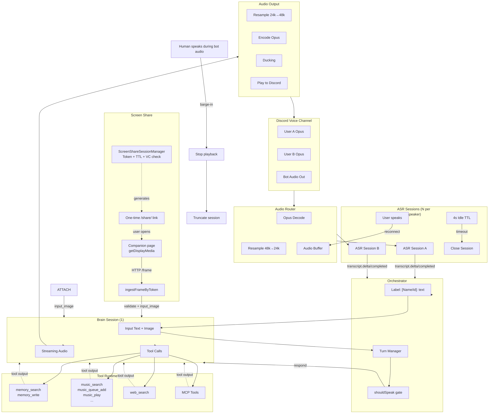

# Discord Realtime Voice Agent v2 — Technical Specification

## Overview

This spec defines an iterated Discord voice bot architecture that builds on the current implementation while adding explicit tool calling, MCP integration, and cleaner separation of concerns.

### Design Principles

1. **Per-speaker transcription** — N transcription sessions, one per active speaker
2. **Single swappable brain** — One Realtime session that handles reasoning + tool calls + audio output
3. **Explicit function tools** — Tools passed to brain session, not embedded in LLM text generation
4. **No approvals for memory writes** — Memory tool as local function, auto-approved
5. **MCP for extensibility** — Governance layer for third-party and admin tools
6. **Cost-optimized idle handling** — Close transcription sessions after idle, reopen with buffered audio

---

## 1. High-Level Architecture


<!-- source: docs/diagrams/realtime-voice-agent-v2.mmd -->

```
┌─────────────────────────────────────────────────────────────────────────────┐
│                          Discord Voice Channel                              │
│  ┌─────────────┐  ┌─────────────┐  ┌─────────────┐                         │
│  │   User A    │  │   User B    │  │     Bot     │                         │
│  │   (Opus)    │  │   (Opus)    │  │   (Output)  │                         │
│  └──────┬──────┘  └──────┬──────┘  └──────┬──────┘                         │
└─────────┼────────────────┼────────────────┼────────────────────────────────┘
          │                │                │
          ▼                ▼                ▼
┌─────────────────────────────────────────────────────────────────────────────┐
│                         Audio Router                                         │
│   - Receive per-user Opus streams                                           │
│   - Decode: Opus → PCM16 48k stereo                                         │
│   - Resample: 48k → 24k mono                                                 │
│   - Route to transcription sessions (input)                                 │
│   - Route brain audio to Discord (output)                                   │
└─────────────────────────────────────────────────────────────────────────────┘
          │                                    │
          ▼                                    ▼
┌─────────────────────┐              ┌─────────────────────┐
│  ASR Sessions (N)   │              │   Brain Session (1) │
│                     │              │                      │
│ - Per active speaker│              │ - Input: text items │
│ - OpenAI Realtime   │              │ - Output: audio      │
│ - Auto-close idle   │              │ - Tools: function+  │
│ - Reopen on speech │              │          MCP         │
└──────────┬──────────┘              └──────────┬──────────┘
           │                                   │
           ▼                                   ▼
    [Speaker A]: text              Tool calls → Tool Runtime
    [Speaker B]: text                     │
           │                              ▼
           ▼                      ┌─────────────────────┐
    Orchestrator                  │   Audio Output     │
    - Collects labeled text       │   - Stream to Discord│
    - Decides turn                │   - Ducking for music│
    - Sends to brain              │   - Barge-in       │
```

---

## 2. Session Types

### 2.1 Transcription Sessions (N = one per active speaker)

**Purpose:** Convert Discord audio to text with speaker attribution

**Behavior:**
- One session created per user when they start speaking
- Session persists while user is active
- **Auto-close after 4 seconds of silence** (`OPENAI_ASR_SESSION_IDLE_TTL_MS`)
- **Reconnect on speech start** — audio buffered while session connects (~200ms)

**Audio Pipeline:**
```
Discord Opus (per-user) → Decode (prism) → PCM 48k stereo
                                         → Downmix to mono
                                         → Resample to 24k
                                         → Buffer in queue
                                         → Append to ASR session
```

**Output:**
- `transcript.delta` — partial transcript
- `transcript.completed` — final transcript

### 2.2 Brain Session (1 = single)

**Purpose:** Reasoning, tool calls, audio generation

**Behavior:**
- Single persistent WebSocket per voice session
- Receives input as text items: `"[DisplayName|userId]: utterance"`
- Manual response creation (not auto-response)
- Streaming audio output

**Configuration:**
```typescript
session.update({
  instructions: "...",        // System prompt
  tools: [...],               // Function tools + MCP tools
  output_modalities: ["audio"],
  audio: { input: {...}, output: {...} },
  turn_detection: null       // Manual response only
})
```

---

## 3. Tooling Strategy

### 3.1 Local Function Tools (always available)

Defined in session config, executed by Tool Runtime:

| Tool | Input | Description |
|------|-------|-------------|
| `memory_search` | `{ query, top_k, namespace, filters }` | Vector search in memory |
| `memory_write` | `{ namespace, items[], dedupe }` | Store facts (NO approval) |
| `music_search` | `{ query, max_results }` | Search for tracks |
| `music_queue_add` | `{ tracks[], position }` | Add to queue |
| `music_play` | `{ index }` | Play track |
| `music_pause` | `{}` | Pause playback |
| `music_resume` | `{}` | Resume playback |
| `music_skip` | `{}` | Skip current track |
| `music_now_playing` | `{}` | Get current track |
| `web_search` | `{ query, recency_days, max_results }` | Web search (optional if MCP) |

### 3.2 MCP for Extensibility

MCP servers provide additional tools with governance:

- Rich web search adapters
- Third-party APIs
- Internal utilities
- Moderation / logging / admin actions

**Approval handling:**
- Memory write is a local function tool (not MCP) — no approval needed
- Other MCP tools can request approval but can be configured to auto-approve

---

## 4. Data Models

### 4.1 Conversation Timeline

```typescript
type SpeakerUtterance = {
  seq: number;              // Global monotonic sequence
  speakerId: string;        // Discord user id
  speakerName: string;      // Display name at time of speech
  text: string;
  startedAtMs: number;
  endedAtMs: number;
  source: "realtime-transcription";
};
```

### 4.2 Tool Call Envelope

```typescript
type ToolCall = {
  toolType: "function" | "mcp";
  name: string;
  arguments: Record<string, unknown>;
  callId: string;
};

type ToolResult = {
  callId: string;
  ok: boolean;
  output: unknown;
  error?: { message: string; code?: string };
};
```

### 4.3 Music Queue State

```typescript
type Track = {
  id: string;
  title: string;
  artist?: string;
  durationMs?: number;
  source: "yt" | "sc" | "local" | "radio" | "spotify-preview";
  streamUrl?: string;
};

type QueueState = {
  guildId: string;
  voiceChannelId: string;
  tracks: Track[];
  nowPlayingIndex: number | null;
  isPaused: boolean;
  volume: number;  // 0..1
};
```

### 4.4 Memory Schema

```typescript
type MemoryItem = {
  id: string;
  namespace: string;  // "global", "guild:<id>", "user:<id>"
  text: string;
  embedding: number[];
  tags?: string[];
  metadata: {
    createdAt: string;
    authorSpeakerId?: string;
    source: "conversation" | "admin" | "import";
  };
};
```

---

## 5. Turn-Taking & Response Policy

### 5.1 Turn Manager Rules

Bot responds when at least one is true:

1. **Direct address** — utterance contains bot name / wake phrase / Discord mention
2. **Direct question** — ends with "?" or matches question classifier + includes bot as addressee
3. **Tool request** — "play X", "queue Y", "remember Z" directed at bot
4. **Moderator mode** — optional periodic summaries after long silence

### 5.2 Debounce

- Wait `SILENCE_MS = 600ms` after last speech ends across all users
- Restart timer if new utterance arrives during debounce

### 5.3 Barge-In / Interruption

When any human starts speaking while bot is outputting audio:
1. Stop Discord playback immediately
2. Mark current assistant output as interrupted
3. Optionally send truncate event to Realtime to remove unplayed audio

---

## 6. Audio Pipeline

### 6.1 Input (Discord → Transcription)

```
Discord Opus per-user
    → prism.opus.Decoder (48k, stereo)
    → Downmix to mono
    → Resample to 24k (linear interpolation)
    → Chunk into 20-60ms frames (480-1440 samples)
    → Base64 encode
    → input_audio_buffer.append
```

### 6.2 Output (Brain → Discord)

```
Brain audio deltas (PCM16 24k mono)
    → Resample to 48k
    → Encode to Opus
    → Play via @discordjs/voice
```

### 6.3 Music + Ducking

- Single audio output to Discord
- When assistant starts speaking: duck music (reduce volume or pause)
- When assistant finishes: resume music

---

## 7. Tool Specifications

### 7.1 memory_search

```typescript
// Input
{ query: string, top_k: number, namespace: string, filters: { tags: string[] } }

// Output
{
  matches: [
    { id: string, text: string, score: number, metadata: { createdAt: string, tags: string[] } }
  ]
}
```

### 7.2 memory_write (NO approvals)

```typescript
// Input
{
  namespace: string,
  items: [{ text: string, tags: string[], metadata: { authorSpeakerId: string } }],
  dedupe: { strategy: "semantic", threshold: number }
}

// Behavior
// - Embed each item
// - Check semantic duplicates in same namespace
// - Upsert if above threshold

// Output
{ written: [{ id: string, status: "inserted" }], skipped: [{ text: string, reason: "duplicate" }] }
```

### 7.3 Music Tools

```typescript
// music_search
{ query: string, max_results: number } → { tracks: Track[] }

// music_queue_add
{ tracks: string[], position: "end" | number } → { queue_length: number, added: string[] }

// music_play
{ index: number } → { now_playing: Track }

// music_pause / music_resume / music_skip / music_now_playing
{} → { /* state */ }
```

### 7.4 web_search

```typescript
// Option A: local function
{ query: string, recency_days: number, max_results: number }
→ { results: [{ title: string, snippet: string, url: string, source: string }], answer: string }

// Option B: via OpenAI Responses API web_search tool
```

---

## 8. Cost Optimization

### 8.1 Transcription Session Idle Handling

```
User speaks → startInboundCapture() → buffer audio in pendingAudioChunks
                                       → async ensureOpenAiAsrSessionConnected()
                                       → flush pending audio once connected

User stops → idle timer starts (4s)
             → close session

User speaks again → buffer audio immediately
                   → create new session (~200ms)
                   → flush buffered audio
```

**Key insight:** Audio buffering during session creation prevents data loss. Latency hit is minimal (~200ms).

### 8.2 Brain Session Idle

**Current:** Brain session stays open 24/7 for instant responses

**Optional aggressive mode:**
- Close brain after X minutes of silence
- Persist conversation history (Redis/SQLite)
- On wake: reconnect + replay history
- **Tradeoff:** ~2s latency penalty + context loss

**Recommendation:** Keep brain open; idle cost is minimal compared to active usage.

---

## 9. Screen Share Support

### 9.1 Discord Limitation

Discord bots **cannot natively view Go Live / screen share streams**. Discord has explicitly said they have no plans to allow bots to view streams due to technical complexity. A "screen share link" is not enough for the bot to get underlying video frames via supported APIs.

### 9.2 Implemented Vision Options

#### Attachment Vision (existing)

User drops a screenshot into Discord → Bot downloads attachment → Sends to Realtime as `input_image` → Responds in voice.

**Use case:** Quick "look at this" with minimal friction.

#### Companion Web Screen Share (active development)

1. User triggers screen share offer (via command or tool call)
2. Bot replies with one-time link (`/share/<token>`) via `ScreenShareSessionManager`
3. User opens link → clicks **Share Screen** (browser `getDisplayMedia`)
4. Companion page sends frames to server over HTTP
5. Server calls `ingestFrameByToken(token, base64Image)` → validates session → sends to Realtime as `input_image`
6. Bot responds in voice

**Key components:**
- `ScreenShareSessionManager` — manages tokenized sessions, TTL (default 12 min), links
- `getLinkCapability()` — checks if public HTTPS is available
- `ingestFrameByToken()` — validates token + VC membership, ingests frame
- Companion page — uses `getDisplayMedia`, sends JPEG frames at configurable rate

**Use case:** Live screen share where user wants real-time help.

### 9.3 Realtime API Vision Input

Send images as `input_image` content parts:

```json
{
  "type": "conversation.item.create",
  "item": {
    "type": "message",
    "role": "user",
    "content": [
      { "type": "input_text", "text": "[Alice|123]: Here's my screen. Where do I click to enable X?" },
      { "type": "input_image", "image_url": "data:image/jpeg;base64,<BASE64>" }
    ]
  }
}
```

### 9.4 Engineering Guidelines

**1. Frame rate**
- Don't send 30fps — blows up cost and context
- Use: on-demand (per request), low-rate (0.5–2 fps), or change-triggered

**2. Image size**
- Downscale to ~1280px wide
- JPEG quality 50–75

**3. Treat frames as evidence**
- If image exists: use it
- If stale: ask for fresh one
- Don't guess UI state

### 9.5 Tools + Vision

When the model "sees" the screen, it can call tools:
- `web_search`: "this error code means…"
- `memory_search`: "this is the same setup as last time…"
- `music_queue_add`: "queue that song I see on screen…"

### 9.6 Configurable Modes

- **Tool-based** — Brain calls `screen_share_analyze()` → captures keyframe → returns description
- **Multimodal** — Sends `input_image` directly to Realtime brain (current approach)

Configurable via settings per guild.

---

## 10. State Management

### Stores

| Store | Technology | Purpose |
|-------|------------|---------|
| Session state | In-memory | Active voice sessions, user captures, turn state |
| Conversation history | SQLite | Recent turns for context injection |
| Memory | SQLite + sqlite-vec | Vector embeddings for semantic search |
| Settings | SQLite | Runtime configuration |
| Actions/audit | SQLite | Logging, cost tracking |

### Optional (not currently used)

- **Redis:** Session caching, pub/sub for multi-instance
- **Postgres:** If scaling beyond single-instance

---

## 11. Observability

### Logs

- Utterance finalized (speaker, latency)
- Brain response created (token/audio duration)
- Tool call (name, args hash, runtime)
- Memory write (count, dedupe stats)
- Music actions (queue mutations)
- Interruption events (barge-in count)

### Metrics

- End-of-speech → first audio delta latency
- Tool round-trip latency
- Transcription completion latency per speaker

---

## 12. Security Guardrails

Since `memory_write` has no human approval:

1. **Namespace constraints:**
   - Bot writes only to: `guild:<id>`, `user:<id>` (only for speaking user)

2. **Rate limits:**
   - Max 5 writes/minute/guild

3. **Toxicity filter:**
   - Reject secrets, tokens, extremely sensitive patterns

4. **High dedupe threshold:**
   - ≥0.90 semantic similarity to skip

5. **Forget command:**
   - Delete memory by id/tag

---

## 13. Implementation Checklist

- [x] Discord join/leave + voice send/receive
- [x] Opus decode + resample → PCM16 24k (existing)
- [ ] Per-speaker transcription sessions (existing, verify idle handling)
- [ ] Brain session with tool calling
- [ ] Tool Runtime (execute function calls, return outputs)
- [ ] Memory read/write as function tools
- [ ] Music queue + playback + ducking
- [ ] Web search as function tool
- [ ] MCP server integration
- [ ] Interruption + truncate support
- [ ] Logging + metrics

---

## 14. Provider Swappability

The brain session can use different Realtime providers:

| Provider | File | Notes |
|----------|------|-------|
| OpenAI | `openaiRealtimeClient.ts` | Default |
| xAI Grok | `xaiRealtimeClient.ts` | Available |
| ElevenLabs | `elevenLabsRealtimeClient.ts` | Available |
| Gemini | `geminiRealtimeClient.ts` | Available |

Transcription layer is constant (OpenAI Realtime), brain is swappable via settings.

---

## 15. Differences from Current Implementation

| Area | Current | This Spec |
|------|---------|-----------|
| Memory tools | LLM generates `memoryLine` in text | Explicit function tool |
| Tool execution | Parse from LLM response | Tool Runtime executes directly |
| Music | Separate flow | Function tools |
| Web search | Separate flow | Function tool |
| MCP | Flag present, not used | Active integration |
| Brain → tool calling | N/A | Realtime function calling |
| Screen share | Tool-based | Tool-based + multimodal option |

---

## 16. Dashboard Changes

The v2 architecture introduces new UI components and data flows that the dashboard must expose.

### 16.1 New Data Types

#### ASR Sessions (Per-Speaker)

Currently the dashboard shows a single "realtime" session state. The v2 architecture requires visibility into per-speaker ASR sessions:

```typescript
type AsrSessionState = {
  userId: string;
  displayName: string;
  connected: boolean;
  createdAt: string | null;
  lastTranscriptAt: string | null;
  idleTimerEndsAt: string | null;
  closedReason: "idle_ttl" | "user_left" | "error" | null;
};
```

#### Tool Call Events

Tool calls are now explicit events rather than inferred from LLM output:

```typescript
type ToolCallEvent = {
  callId: string;
  toolName: string;
  toolType: "function" | "mcp";
  arguments: Record<string, unknown>;
  startedAt: string;
  completedAt: string | null;
  runtimeMs: number | null;
  success: boolean;
  outputSummary: string | null;
  error: string | null;
};
```

#### MCP Status

```typescript
type McpServerStatus = {
  serverName: string;
  connected: boolean;
  tools: { name: string; description: string }[];
  lastError: string | null;
};
```

### 16.2 Updated Dashboard Components

#### Voice Monitor Updates

**Current:** Single realtime session state, aggregated STT stats

**Needed:**

| Component | Description |
|-----------|-------------|
| **ASR Panel** | Grid of per-user ASR sessions with status (connected/idle/closed), idle TTL countdown |
| **Tool Call Log** | Scrollable list of tool calls with name, runtime, success/failure |
| **MCP Panel** | List of connected MCP servers with available tools |
| **Brain Tools Config** | Display which tools are currently registered in the brain session |

#### Memory Tab Updates

**Current:** Search and browse stored memories

**Needed:**

| Component | Description |
|-----------|-------------|
| **Write Actions** | Log of `memory_write` calls with count, dedupe stats (inserted/skipped) |
| **Dedupe Stats** | Show threshold used, duplicates detected vs stored |

#### Music Panel Updates

**Current:** Now playing display

**Needed:**

| Component | Description |
|-----------|-------------|
| **Tool-Driven Controls** | Show music operations as tool calls (music_queue_add, music_play, etc.) |
| **Queue State** | Current queue from `QueueState` model |

### 16.3 New Metrics

| Metric | Source | Description |
|--------|--------|-------------|
| Tool Call Latency | ToolCallEvent.runtimeMs | Time from tool call to result |
| Memory Write Rate | memory_write events | Writes per minute per guild |
| ASR Session Churn | ASR open/close events | Sessions created vs closed |
| MCP Tool Usage | ToolCallEvent by toolType | Which MCP tools are called |
| Memory Dedupe Rate | memory_write output | % skipped as duplicate |

### 16.4 API Endpoint Changes

#### New Endpoints

```
GET /api/voice/asr-sessions
  → Returns: { sessions: AsrSessionState[] }

GET /api/voice/tool-events
  → Returns: { events: ToolCallEvent[] }

GET /api/mcp/status
  → Returns: { servers: McpServerStatus[] }
```

#### Updated Endpoints

```
GET /api/voice/events
  → Add: tool_call events to VoiceEvent type
  → Add: asr_session events to VoiceEvent type

GET /api/voice/state
  → Add: asrSessions, toolCalls, mcpStatus to response
```

### 16.5 Implementation Notes

1. **Incremental updates:** Add new data types to existing SSE stream rather than new endpoints
2. **Backward compat:** Keep existing voice state structure, extend with new fields
3. **Performance:** Tool call events can be high-volume; consider sampling or aggregation for display
4. **No floating toasts:** Per spec preference, show tool outcomes inline in the event log, not toast popups
