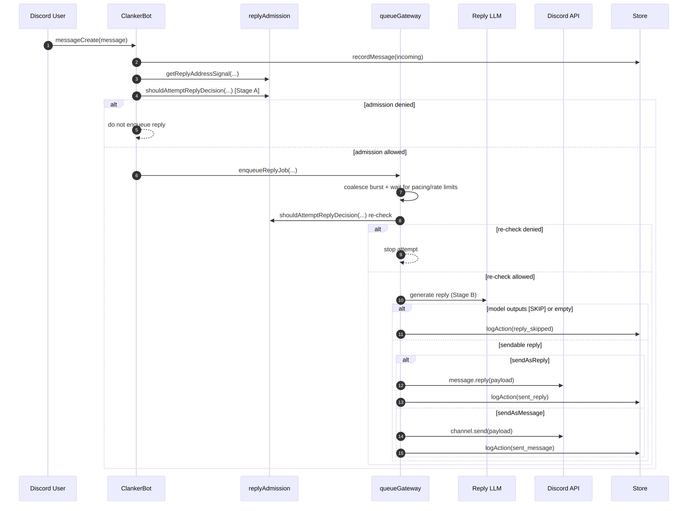
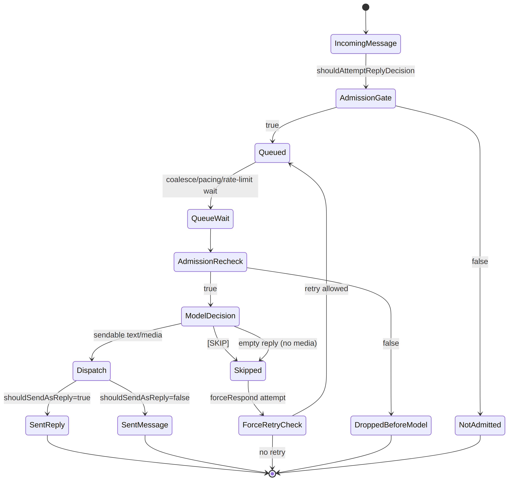
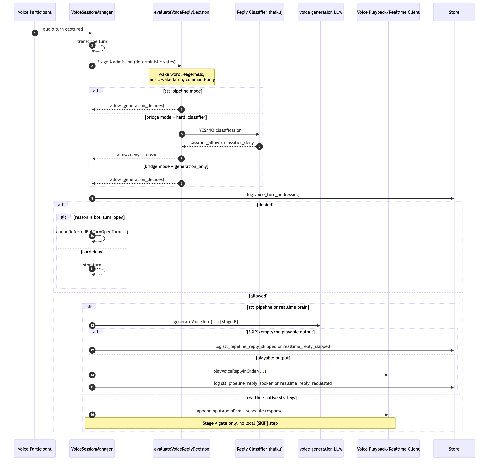
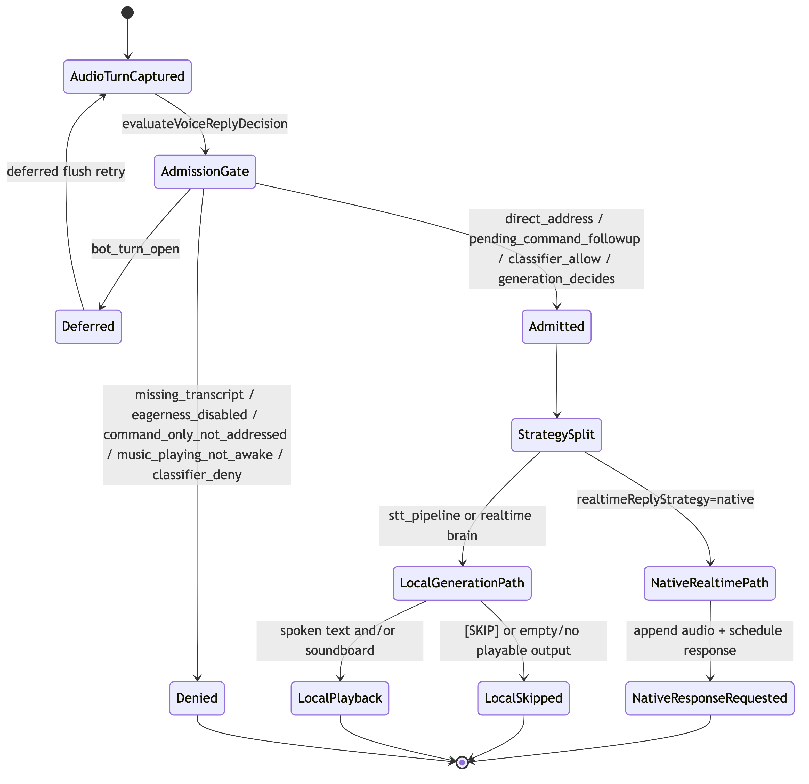

# Reply Decision Flow (Text + Voice Chat)

This document describes the current two-stage reply policy and how text and voice differ at execution time.

## 0) Visual Flows (Text + Chat)

### Text reply sequence

<!-- source: docs/diagrams/reply-decision-text-sequence.mmd -->

### Text reply state machine

<!-- source: docs/diagrams/reply-decision-text-state.mmd -->

### Voice chat reply sequence

<!-- source: docs/diagrams/reply-decision-chat-sequence.mmd -->

### Voice chat reply state machine

<!-- source: docs/diagrams/reply-decision-chat-state.mmd -->

## 1) Stage A: Should we even attempt a reply?

### Text (`src/bot/replyAdmission.ts`, used by `src/bot.ts` + `src/bot/queueGateway.ts`)

`shouldAttemptReplyDecision(...)` allows text reply evaluation when either:

- the turn is address-triggered (`addressSignal.triggered`) or force-responded, or
- `permissions.allowInitiativeReplies` is enabled and the bot appears in the recent channel window.

Current addressing signal reasons:

- `direct`: explicit mention or reply-thread direct address.
- `name_exact`: exact bot-name token match.
- `name_alias`: exact match on a configured bot-name alias.
- `llm_direct_address`: LLM confidence classifier marked the turn as likely directed at the bot.
- `llm_decides`: no direct signal; deferred to LLM evaluation.

Important nuance: force-respond is only automatic for high-certainty direct signals; `llm_direct_address` does not auto-force (`shouldForceRespondForAddressSignal`).

The text path applies this admission gate before queueing and again right before generation, so non-addressed channel chatter does not continuously hit the main reply model.

### Voice (`src/voice/voiceSessionManager.ts`)

`evaluateVoiceReplyDecision(...)` is the admission gate. It combines:

- direct-address signal (`isVoiceTurnAddressedToBot` + direct-address confidence),
- low-signal filtering (`isLowSignalVoiceFragment` / wake-ping checks),
- focused-speaker + recent-bot-reply continuation windows,
- `voice.replyEagerness` gating for non-direct turns,
- a YES/NO classifier LLM (`voice.replyDecisionLlm`) when deterministic fast paths do not resolve the turn.

Fast-path allow reasons include `direct_address_fast_path`, `focused_speaker_followup`, and `bot_recent_reply_followup`. Fast-path deny reasons include `missing_transcript`, `bot_turn_open`, `low_signal_fragment`, and `eagerness_disabled_without_direct_address`.

If this stage returns `allow: false`, the bot does not speak for that turn.

## 2) Stage B: If admitted, should we still skip?

### Text

After Stage A passes, the main reply LLM runs with explicit `[SKIP]` support for non-required turns.

- Non-addressed turns: model can choose `[SKIP]`.
- Force-required turns: prompt marks reply as required (except safety refusal).
- `llm_direct_address` turns are admitted but not force-required, so they can still `[SKIP]`.

If the model output is empty (and no media-only payload is viable), the turn is also treated as skipped (`reply_skipped` with `empty_reply`/`empty_reply_after_media`).

So text keeps a second backstop: policy gate first, then model-level skip.

### Voice

- `stt_pipeline`: after Stage A, generation runs with `isEagerTurn` for non-direct turns; generation can still return `[SKIP]`/empty and produce no spoken reply.
- realtime + `voice.realtimeReplyStrategy = brain`: same second-stage generation/skip behavior as STT.
- realtime + `voice.realtimeReplyStrategy = native`: Stage A is the primary gate before forwarding audio to native realtime response creation (no local `[SKIP]` stage).

Join-window greetings are a special case: generation can be force-retried to avoid silence right after join.

## 3) Text Queue + Dispatch

Queue behavior before dispatch:

- Per-channel queue can coalesce burst messages from the same author using `activity.replyCoalesceWindowSeconds` and `activity.replyCoalesceMaxMessages`.
- Coalesced jobs share one reply attempt with combined `triggerMessageIds`.

Dispatch behavior after Stage A/B resolves to "send":

- Non-addressed turns always send as channel messages (`sent_message`).
- Direct/force-threaded turns in non-initiative channels send as replies (`sent_reply`).
- In initiative channels, threaded candidates use mixed routing (`shouldSendAsReply`): 65% reply, otherwise channel message.

## 4) Config semantics

- `activity.replyLevelInitiative` and `activity.replyLevelNonInitiative` are **eagerness signals**, not literal random percentages.
- `permissions.allowInitiativeReplies` controls whether non-addressed text turns can enter Stage A.
- `activity.replyCoalesceWindowSeconds` / `activity.replyCoalesceMaxMessages` control text burst coalescing before model calls.
- `replyFollowupLlm` (optional) can override provider/model for text follow-up regeneration passes.
- `voice.replyEagerness` biases the voice decision gate for non-direct turns.
- `voice.replyDecisionLlm.*` controls the voice admission classifier (`enabled`, provider/model, attempt count, prompts).
- `voice.realtimeReplyStrategy` decides realtime path shape: `brain` (local generation with skip backstop) vs `native` (admission-only gate then forward).

## 5) Observability

Useful logs for tuning:

- Text: `reply_skipped`, `sent_reply`, `sent_message`
- Voice admission: `voice_turn_addressing` (`allow`, `reason`, `directAddressed`, `llmResponse`, classifier model/provider, conversation context fields)
- Voice generation outcomes: `stt_pipeline_reply_spoken`, `realtime_reply_requested`, `realtime_reply_skipped`

These logs are the source of truth when diagnosing over-replying or missed replies.

## 6) Latency-First Model Tuning

Model choices that matter most for turn latency:

- Text generation: `llm.provider` + `llm.model`.
- `replyFollowupLlm.enabled` + `replyFollowupLlm.provider/model`: can add a second generation pass after model-requested lookups (`webSearchQuery`, `memoryLookupQuery`, `imageLookupQuery`).
- Voice generation (STT + realtime brain): `voice.generationLlm.provider/model`.
- `voice.replyDecisionLlm.provider/model`: classifier model for ambiguous voice turns before the bot decides to speak.
- Voice runtime-specific levers depend on path: realtime native uses `voice.openaiRealtime.model` / `voice.geminiRealtime.model`; STT + brain paths use `voice.sttPipeline.transcriptionModel` + `voice.sttPipeline.ttsModel`.

Model choice with lower immediate impact:

- `memoryLlm.provider/model`: used for memory extraction on ingest; this is not on the synchronous text reply critical path.

When tuning, check reply performance phases (`llm1Ms`, `followupMs`) and voice `voice_turn_addressing` logs before/after each model change.
