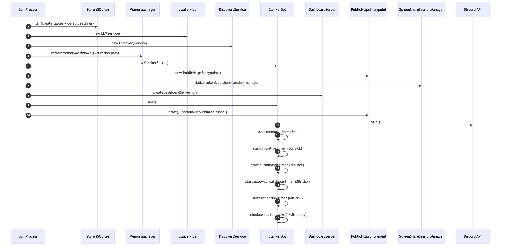
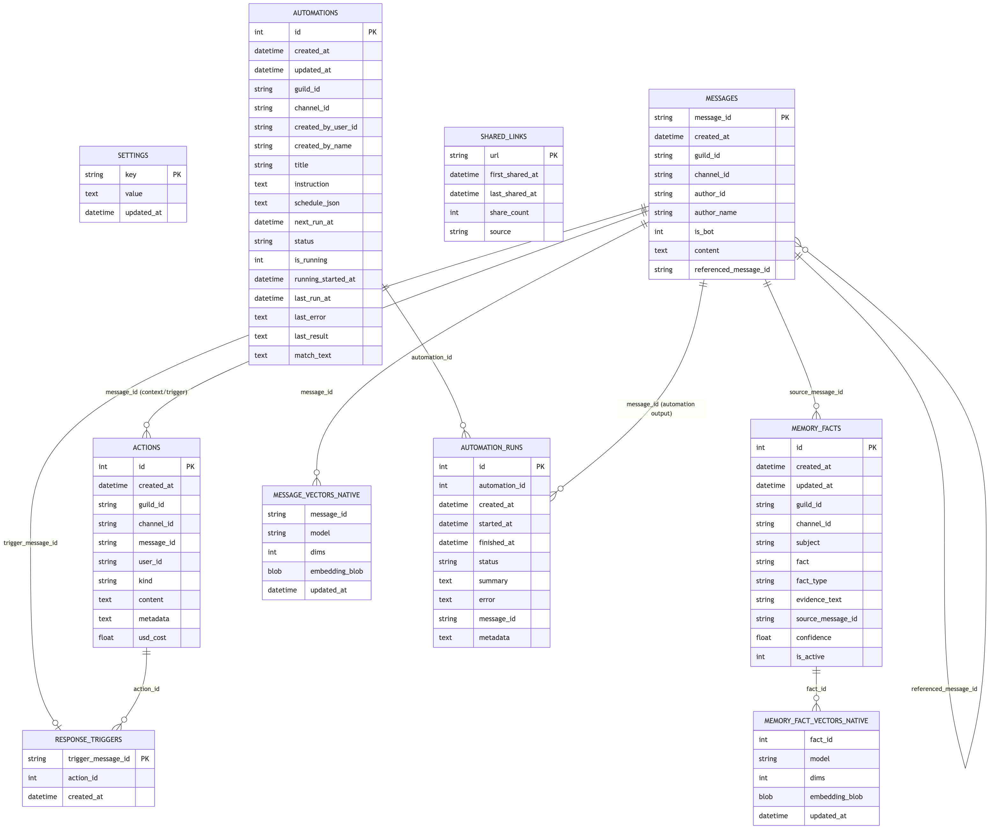
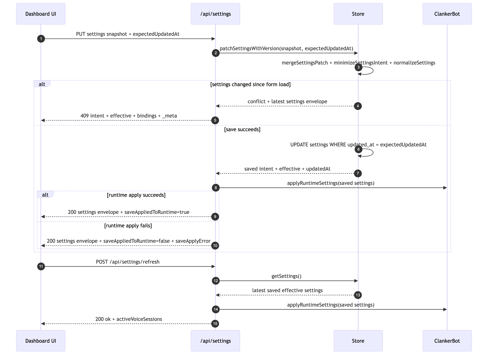
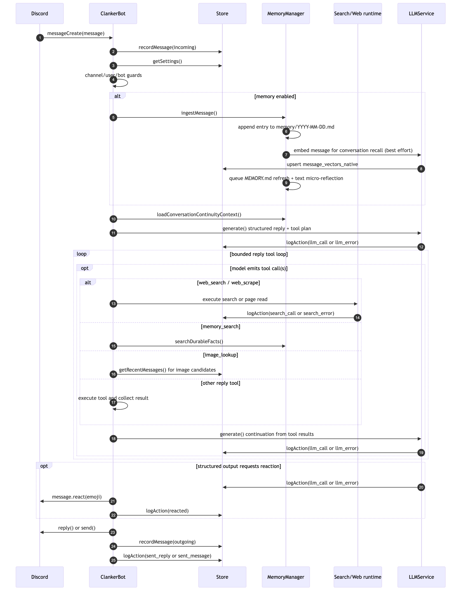
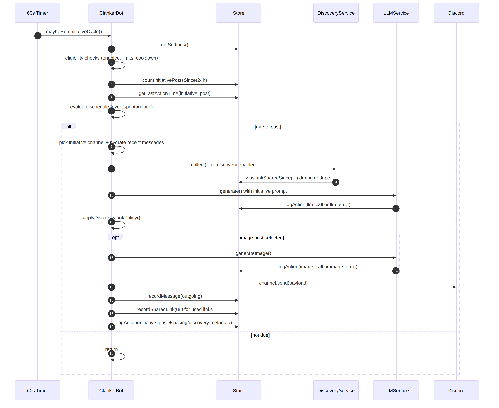

# Clanker Conk Technical Architecture

This document explains how the bot is wired, how data moves through the system, and the key runtime flows.

## 1. High-Level Components

Code entrypoint:
- `src/app.ts`: bootstraps storage, services, bot, and dashboard server.

Core runtime:
- `src/bot.ts`: Discord event handling and orchestration.
- `src/bot/*`: extracted bot domains (`automationControl`, `initiativeSchedule`, `queueGateway`, `replyAdmission`, `replyFollowup`, `startupCatchup`, `voiceReplies`).
- `src/llm.ts`: model provider abstraction (OpenAI, Anthropic, xAI/Grok, or Claude Code), usage + cost logging, embeddings, image/video generation, ASR, and TTS.
- `src/llmClaudeCode.ts`: Claude Code CLI invocation/parsing helpers used by `LLMService`.
- `src/memory.ts`: append-only daily journaling + LLM-based fact extraction + hybrid memory retrieval (lexical + vector).
- `src/discovery.ts`: external link discovery for initiative posts.
- `src/store.ts`: SQLite persistence orchestration.
- `src/store/*`: settings normalization and store helper utilities.
- `src/voice/voiceSessionManager.ts`: voice orchestration and session lifecycle.
- `src/voice/voiceJoinFlow.ts`, `src/voice/voiceStreamWatch.ts`, `src/voice/voiceOperationalMessaging.ts`, `src/voice/voiceDecisionRuntime.ts`: extracted voice domains.
- `src/publicHttpsEntrypoint.ts`: optional Cloudflare Quick Tunnel runtime for exposing local dashboard/API over public HTTPS.
- `src/screenShareSessionManager.ts`: tokenized browser screen-share session lifecycle and frame relay into voice stream-watch ingest.

Control plane:
- `src/dashboard.ts`: REST API and static dashboard hosting, including tunnel-host public/private route gating.
- `dashboard/src/*`: React dashboard (polling stats/actions/memory/settings and writing settings back).

Storage:
- `data/clanker.db`: runtime SQLite database.
- `memory/YYYY-MM-DD.md`: append-only daily journal files.
- `memory/MEMORY.md`: operator-facing curated snapshot for dashboard inspection (not directly injected into model prompts).

## 2. Runtime Lifecycle

<!-- source: docs/diagrams/runtime-lifecycle.mmd -->

## 3. Data Model (SQLite)

Main tables created in `src/store.ts`:
- `settings`: single `runtime_settings` JSON blob.
- `messages`: normalized message history (user + bot messages).
- `actions`: event log (replies, reactions, initiative posts, llm/image calls, errors) with `usd_cost`.
- `memory_facts`: LLM-extracted durable facts with type/confidence/evidence.
- `memory_fact_vectors_native`: sqlite-vec-compatible embeddings per fact/model for semantic recall.
- `shared_links`: external links already posted (for dedupe windows).
- `automations`: natural-language schedule definitions and next-run state.
- `automation_runs`: per-run execution history for each automation.

Table relationship diagram (logical relationships):

<!-- source: docs/diagrams/data-model.mmd -->

Note: the implementation uses logical joins and lookups; SQLite foreign-key constraints are not currently declared.

Cost aggregation:
- `llm_call` rows store `usd_cost`.
- `/api/stats` uses `Store.getStats()` to sum total and daily LLM spend.

## 4. Settings Flow

Settings are patched through dashboard API and normalized in `Store.patchSettings()` / `normalizeSettings()`:
- clamping numeric ranges,
- sanitizing list fields,
- defaulting missing keys,
- ensuring initiative/discovery config is always valid.

The bot reads settings at decision time (`store.getSettings()`), so updates apply without restart.

<!-- source: docs/diagrams/settings-flow.mmd -->

## 5. Message Event Flow (Replies + Reactions)

Entrypoint: Discord `messageCreate` handler in `ClankerBot`.

<!-- source: docs/diagrams/message-event-flow.mmd -->

Key guardrails:
- channel allow/block lists.
- blocked users.
- per-hour message and reaction limits.
- minimum seconds between bot messages.
- direct-address and recent-bot-context gating for unsolicited replies (with LLM skip as backstop).

## 6. Latency-Critical Model Choices

Core sequence diagrams for this topic:
- `docs/diagrams/message-event-flow.mmd` (text message handling path).
- `docs/diagrams/runtime-lifecycle.mmd` (boot/runtime timers that can add queue delay).
- `docs/diagrams/settings-flow.mmd` (how model changes apply live without restart).

Highest-impact model settings for user-visible reply latency:
- `llm.provider` + `llm.model`: main reply generation model (primary synchronous call in the text/voice brain path). This is reported as `llm1Ms` in reply performance stats.
- `replyFollowupLlm.enabled` + `replyFollowupLlm.provider/model`: optional second-pass generation model used after model-requested web/memory/image lookup directives. This contributes to `followupMs` and is a major tail-latency lever.
- `voice.replyDecisionLlm.provider/model`: YES/NO classifier for ambiguous voice turns before speaking. Slower classifiers increase gate time before turn output.
- `voice.openaiRealtime.model` / `voice.geminiRealtime.model` or `voice.sttPipeline.transcriptionModel` + `voice.sttPipeline.ttsModel`: these directly shape voice-turn latency after admission.
- `llm.provider = claude-code`: each generation runs through local CLI invocation/parsing, which can add extra latency and jitter versus direct API providers.

Lower impact on immediate reply latency:
- `memoryLlm.provider/model` mainly affects asynchronous memory extraction after message ingest, not the synchronous text reply loop.

How to validate changes:
- `Store.getReplyPerformanceStats()` aggregates `memorySliceMs`, `llm1Ms`, and `followupMs`.
- voice action logs with `kind=voice_runtime` and `content=voice_turn_addressing` include classifier provider/model metadata.

## 7. Initiative Post Flow

Initiative logic runs every 60 seconds, but posting depends on schedule rules and caps.

<!-- source: docs/diagrams/initiative-post-flow.mmd -->

Scheduling modes:
- `even`: post only when elapsed time exceeds `max(minMinutesBetweenPosts, 24h/maxPostsPerDay)`.
- `spontaneous`: after min gap, uses probabilistic ramps + force-due bound.

## 8. Discovery Subsystem (Initiative Creativity)

`DiscoveryService.collect()`:
1. Builds topic seeds from preferred topics + recent chat text.
2. Fetches enabled sources in parallel:
   - Reddit hot JSON
   - Hacker News top stories
   - YouTube channel RSS
   - configured RSS feeds
   - optional X handles via Nitter RSS
3. Normalizes/filters candidates:
   - URL safety + tracking param cleanup
   - freshness window
   - NSFW filtering
   - repost dedupe against `shared_links`
4. Scores + ranks candidates and selects prompt shortlist.

If a cycle requires a link and model output includes none, bot can append one fallback discovered link or skip posting.

## 9. Dashboard Read/Write Patterns

Dashboard polling:
- `/api/stats` every 10s
- `/api/actions` every 10s
- `/api/memory` every 30s
- `/api/settings` on load (and manual reload after save)

Dashboard writes:
- `PUT /api/settings`: saves all settings.
- `POST /api/memory/refresh`: forces immediate memory markdown regeneration.

Dashboard read APIs also include:
- `GET /api/automations`: list automations by guild/channel/status/query.
- `GET /api/automations/runs`: list run history for one automation.

## 10. Action Log Kinds

Common `actions.kind` values in current runtime:
- Messaging/initiative: `sent_reply`, `sent_message`, `reply_skipped`, `initiative_post`, `automation_post`
- Reactions: `reacted`, `voice_soundboard_play`
- LLM + media generation: `llm_call`, `llm_error`, `image_call`, `image_error`, `video_call`, `video_error`, `gif_call`, `gif_error`
- Memory pipeline: `memory_fact`, `memory_extract_call`, `memory_extract_error`, `memory_embedding_call`, `memory_embedding_error`
- Search + video context: `search_call`, `search_error`, `video_context_call`, `video_context_error`
- Voice runtime: `voice_session_start`, `voice_session_end`, `voice_turn_in`, `voice_turn_out`, `voice_runtime`, `voice_intent_detected`, `voice_error`
- Speech services: `asr_call`, `asr_error`, `tts_call`, `tts_error`
- Automation lifecycle: `automation_created`, `automation_updated`, `automation_run`, `automation_error`
- Runtime + generic failures: `bot_runtime`, `bot_error`

These power the activity stream and metrics/cost widgets in the dashboard.

## 11. Failure Behavior

- LLM failures are logged (`llm_error`) and bubble to caller; bot-level wrappers log `bot_error`.
- Reaction failures (permission/emoji issues) are swallowed.
- Image generation failures fall back to text-only initiative posts.
- Discovery fetch failures are captured per source; initiative cycle can still continue with no links.
