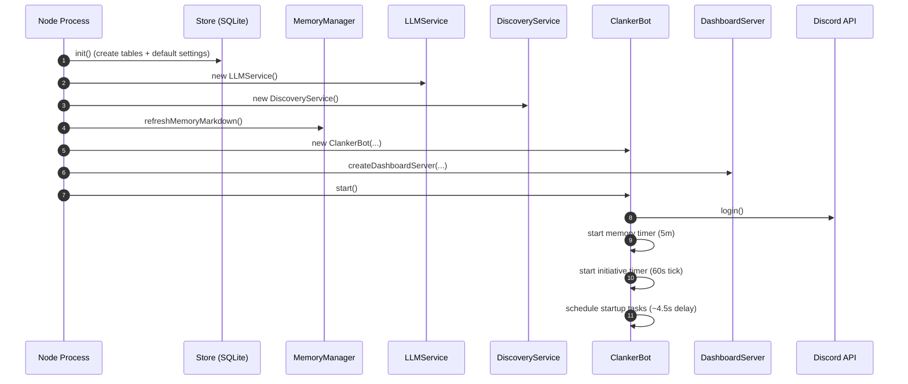
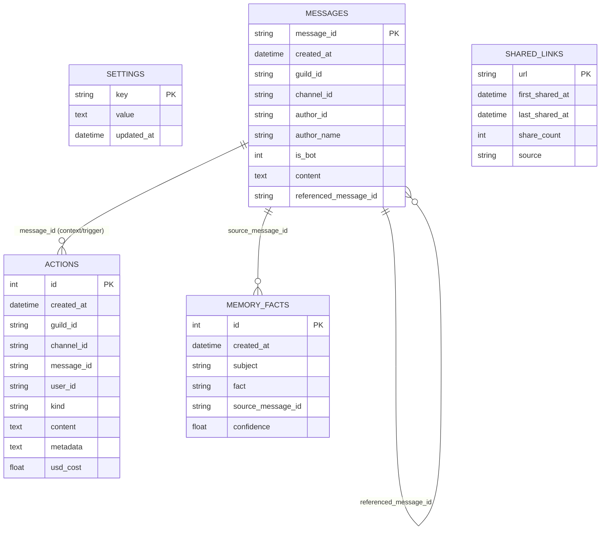
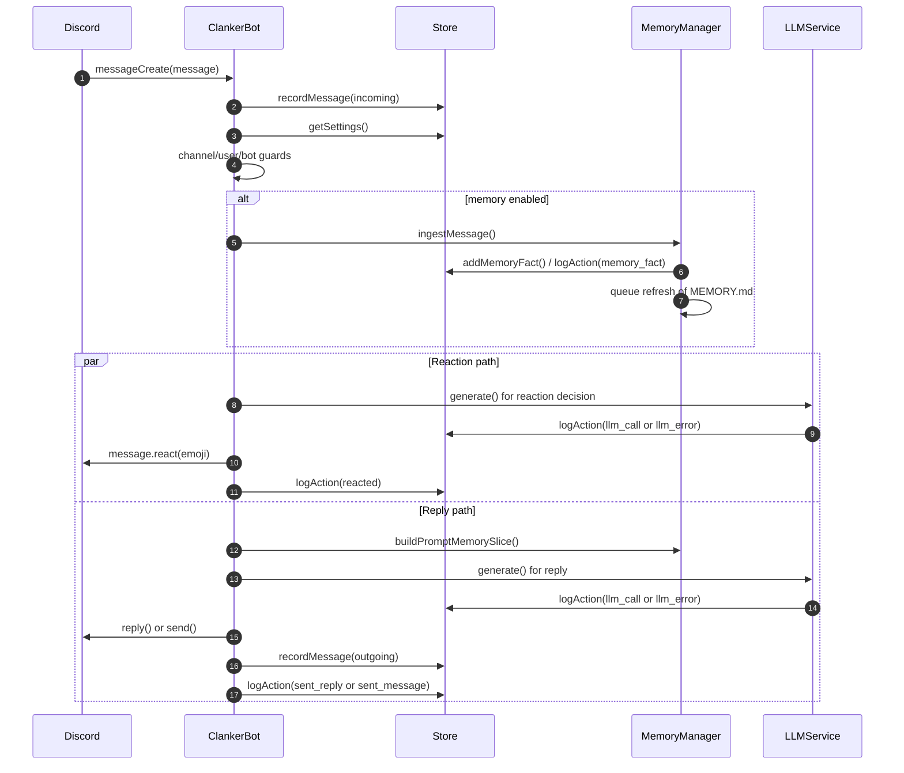

# Clanker Conk Technical Architecture

This document explains how the bot is wired, how data moves through the system, and the key runtime flows.

## 1. High-Level Components

Code entrypoint:
- `src/app.js`: bootstraps storage, services, bot, and dashboard server.

Core runtime:
- `src/bot.js`: Discord event handling, reply/react logic, initiative scheduling, and posting.
- `src/llm.js`: model provider abstraction (OpenAI or Anthropic), usage + cost logging, image generation.
- `src/memory.js`: heuristic fact extraction + `memory/MEMORY.md` generation.
- `src/discovery.js`: external link discovery for initiative posts.
- `src/store.js`: SQLite persistence and settings normalization.

Control plane:
- `src/dashboard.js`: REST API and static dashboard hosting.
- `dashboard/src/*`: React dashboard (polling stats/actions/memory/settings and writing settings back).

Storage:
- `data/clanker.db`: runtime SQLite database.
- `memory/MEMORY.md`: generated memory snapshot used in prompts.

## 2. Runtime Lifecycle

## 3. Data Model (SQLite)

Main tables created in `src/store.js`:
- `settings`: single `runtime_settings` JSON blob.
- `messages`: normalized message history (user + bot messages).
- `actions`: event log (replies, reactions, initiative posts, llm/image calls, errors) with `usd_cost`.
- `memory_facts`: extracted user facts.
- `shared_links`: external links already posted (for dedupe windows).

Table relationship diagram (logical relationships):

Note: the implementation uses logical joins and lookups; SQLite foreign-key constraints are not currently declared.

Cost aggregation:
- `llm_call` rows store `usd_cost`.
- `/api/stats` uses `Store.getStats()` to sum total and daily LLM spend.

## 4. Settings Flow

Settings are patched through dashboard API and normalized in `Store.patchSettings()` / `normalizeSettings()`:
- clamping numeric ranges,
- sanitizing list fields,
- defaulting missing keys,
- ensuring initiative/discovery config is always valid.

The bot reads settings at decision time (`store.getSettings()`), so updates apply without restart.

## 5. Message Event Flow (Replies + Reactions)

Entrypoint: Discord `messageCreate` handler in `ClankerBot`.

Key guardrails:
- channel allow/block lists.
- blocked users.
- per-hour message and reaction limits.
- minimum seconds between bot messages.
- direct-address and random-chance gating for replies.

## 6. Initiative Post Flow

Initiative logic runs every 60 seconds, but posting depends on schedule rules and caps.

Scheduling modes:
- `even`: post only when elapsed time exceeds `max(minMinutesBetweenPosts, 24h/maxPostsPerDay)`.
- `spontaneous`: after min gap, uses probabilistic ramps + force-due bound.

## 7. Discovery Subsystem (Initiative Creativity)

`DiscoveryService.collect()`:
1. Builds topic seeds from preferred topics + recent chat text.
2. Fetches enabled sources in parallel:
   - Reddit hot JSON
   - Hacker News top stories
   - YouTube channel RSS
   - configured RSS feeds
   - optional X handles via Nitter RSS
3. Normalizes/filters candidates:
   - URL safety + tracking param cleanup
   - freshness window
   - NSFW filtering
   - repost dedupe against `shared_links`
4. Scores + ranks candidates and selects prompt shortlist.

If a cycle requires a link and model output includes none, bot can append one fallback discovered link or skip posting.

## 8. Dashboard Read/Write Patterns

Dashboard polling:
- `/api/stats` every 10s
- `/api/actions` every 10s
- `/api/memory` every 30s
- `/api/settings` on load (and manual reload after save)

Dashboard writes:
- `PUT /api/settings`: saves all settings.
- `POST /api/memory/refresh`: forces immediate memory markdown regeneration.

## 9. Action Log Kinds

Observed `actions.kind` values:
- Messaging: `sent_reply`, `sent_message`, `initiative_post`
- Reactions: `reacted`
- LLM: `llm_call`, `llm_error`
- Image: `image_call`, `image_error`
- Memory: `memory_fact`
- Errors: `bot_error`

These power the activity stream and metrics/cost widgets in the dashboard.

## 10. Failure Behavior

- LLM failures are logged (`llm_error`) and bubble to caller; bot-level wrappers log `bot_error`.
- Reaction failures (permission/emoji issues) are swallowed.
- Image generation failures fall back to text-only initiative posts.
- Discovery fetch failures are captured per source; initiative cycle can still continue with no links.
