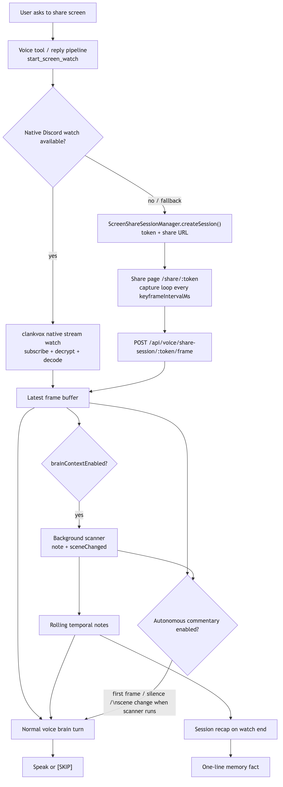

# Screen Watch System

Complete documentation of the screen watch pipeline: session lifecycle, transport selection, frame processing, and how the agent sees and reasons about what's on screen.

See also: [`docs/public-https-entrypoint-spec.md`](../public-https-entrypoint-spec.md) (public URL gating).
Native Discord receive status: [`../native-discord-screen-share.md`](../native-discord-screen-share.md)
Cross-cutting settings contract: [`../settings.md`](../settings.md)

Persistence, preset inheritance, dashboard envelope shape, and save/version semantics live in [`../settings.md`](../settings.md). This document covers the screen-watch pipeline and the stream-watch settings that shape voice-local visual context.

## Design Philosophy

Screen sharing gives the agent eyes. The architecture follows the same autonomy principle as the rest of the system: **give the agent rich context and let it decide what to do.**

A human sitting next to someone sharing their screen would:
- See the screen continuously
- Remember what they saw before (temporal awareness)
- Decide when to comment, ask a question, or stay quiet
- Reference earlier screen states in conversation ("you changed that function signature from before")

The agent should work the same way. Two independent, always-on layers feed into the brain's normal context:

```
Every frame → Scanner (cheap/fast model) → rolling temporal notes
                                                    ↓
                                             always in voice prompt

Every voice turn during active screen watch:
    brain sees = latest raw frame + rolling notes + conversation
    brain decides what to say (or [SKIP])

Autonomous commentary (silence / scene change):
    brain gets frame + notes, decides whether to speak
```

**Scanner** builds temporal awareness — "they switched from VS Code to the browser", "new error dialog appeared", "they've been on this settings page for 30 seconds."

**Direct frame** gives visual accuracy — the model sees exactly what's on screen right now.

These are **orthogonal, not mutually exclusive.** The scanner always runs to build rolling context. The brain always sees the current frame when generating a reply. The brain decides whether and how to reference what it sees.

## Architecture Overview



<!-- source: docs/diagrams/screen-share-system.mmd -->

```
Discord VC user says "share my screen"
         │
         ▼
  Reply pipeline / voice tool
  (start_screen_watch)
         │
         ▼
  Runtime chooses watch transport
  ├─ Native Discord watch (preferred)
  │  ├─ validate requester + target context in VC
  │  ├─ subscribe to the target's active Discord stream in clankvox
  │  ├─ clankvox decrypts and forwards encoded video frames
  │  ├─ Bun decodes sampled keyframes into JPEG
  │  └─ feed frames to the processing pipeline
  └─ Share-link fallback
     ├─ ScreenShareSessionManager.createSession()
     ├─ bot sends /share/:token link
     ├─ browser getDisplayMedia() capture loop
     └─ POST /api/voice/share-session/:token/frame
```

## Frame Processing Pipeline

```
  ┌──────────────┐
  │  FRAME IN    │
  └──────┬───────┘
         │
         ├────────────────────────────────────────────┐
         │                                            │
  ┌──────▼───────────────┐                   ┌───────▼────────┐
  │  SCANNER             │                   │  LATEST FRAME  │
  │  (cheap/fast model)  │                   │  (stored for   │
  │                      │                   │   brain access) │
  │  Produces:           │                   └───────┬────────┘
  │  - note (observation)│                           │
  │  - sceneChanged bool │                           │
  └──────┬───────────────┘                           │
         │                                            │
  ┌──────▼───────────────┐                           │
  │  ROLLING NOTES       │                           │
  │  (brainContextEntries│                           │
  │   max 8, with aging) │                           │
  └──────┬───────────────┘                           │
         │                                            │
         └──────────────┬─────────────────────────────┘
                        │
                        ▼
              ┌─────────────────────┐
              │  VOICE BRAIN        │
              │                     │
              │  Sees on ANY turn:  │
              │  - Current frame    │
              │  - Rolling notes    │
              │  - Conversation     │
              │                     │
              │  Decides:           │
              │  - Speak or [SKIP]  │
              │  - What to say      │
              │  - Reference screen │
              │    or ignore it     │
              └─────────┬───────────┘
                        │
                  on session end
              ┌─────────▼───────────┐
              │  SESSION RECAP      │
              │  (summarize notes   │
              │   into memory fact) │
              └─────────────────────┘
```

### Scanner (always-on background)

The scanner runs a cheap/fast model on ingested frames at a configurable interval (default every 4 seconds). It extracts a short observation note and a `sceneChanged` flag. Notes accumulate in `brainContextEntries` (max 8 by default), with timestamps for aging.

The scanner does NOT decide whether the brain should speak. Its job is observation only — building the temporal context that lets the brain say things like "oh you're back on the code editor" or "looks like that error is gone now."

Scanner provider and model are independently configurable (`brainContextProvider`, `brainContextModel`) and do not affect whether the brain sees raw frames.

### Brain frame access

During any voice turn while screen watch is active, the generation model receives:
- **Current raw frame** as an image input (the latest captured JPEG)
- **Rolling scanner notes** in the prompt context (timestamped observations)
- **Normal conversation context** (transcript, memory, tools, etc.)

This happens on ALL turns — user-initiated, autonomous commentary, tool follow-ups. The brain doesn't need a special trigger to see the screen. It always has access and decides what's relevant.

### Autonomous commentary triggers

When nobody is speaking, the system periodically checks whether to fire a brain turn with the current frame. Triggers:

- **Scene change** — scanner flagged `sceneChanged: true`
- **Extended silence** — no speech for 10+ seconds while frames are arriving
- **First frame** — initial share start

These triggers don't gate whether the brain speaks — they trigger a normal voice turn where the brain sees the frame + notes and decides whether to comment (or `[SKIP]`). The `autonomousCommentaryEnabled` setting controls whether these proactive triggers fire at all.

Autonomous commentary is treated as optional speech, not as a normal conversational obligation:
- It does not start while another voice reply is already generating, draining, or deferred.
- If fresh user speech arrives before commentary audio begins, the commentary is dropped rather than requeued behind the user turn.
- Deferred stream-watch commentary keeps its original `stream_watch_brain_turn:*` source so the optional-speech interruption rules still apply after a flush delay.

### Session recap

When a watch session ends, the default text model summarizes the accumulated keyframe notes into a one-line memory fact for long-term context.

## Session Lifecycle

### Creation

- Triggered by: explicit user request (regex match on "share screen" etc.), model intent (confidence >= 0.66), or voice tool `start_screen_watch`
- `start_screen_watch` is the only model-facing action
- `start_screen_watch` can optionally include `{ target: "display name or user id" }` when the agent wants a specific Discord sharer
- Realtime instructions can already list active Discord sharers before a watch starts
- Runtime tries native Discord watch first through the active voice session
- Native watch binds an explicit target first when one is provided and resolves cleanly
- Without an explicit target, native watch auto-binds only when runtime can identify a safe target:
  - requester is actively sharing, or
  - exactly one user is actively sharing
- If an explicit target resolves to someone in voice who is not actively sharing, link fallback can still target that user
- If native watch is unavailable, the runtime falls back to `ScreenShareSessionManager.createSession()`
- Fallback sessions reuse existing requester+target links when possible

### Native Discord watch

- `clankvox` subscribes to the target user's active Discord stream
- `clankvox` emits encoded H264/VP8 frame payloads through Bun IPC
- Bun decodes sampled keyframes to JPEG with `ffmpeg`
- Decoded JPEGs are forwarded into the existing stream-watch pipeline
- The latest decoded frame becomes normal voice-brain context on active turns
- If multiple unrelated Discord sharers are active, the agent can pick one with `start_screen_watch({ target: "name" })`
- If multiple unrelated Discord sharers are active and no explicit target is provided, runtime does not guess a native target
- The same rolling-note scanner and commentary triggers apply regardless of transport
- Active native sharer metadata is prompt context, but image visibility still requires an active watch session

### Share page fallback

- Route: `GET /share/:token`
- Browser-rendered HTML with embedded JS (no framework)
- `getDisplayMedia()` for screen/window/tab capture
- Capture loop: canvas -> JPEG -> POST to frame endpoint
- Countdown timer showing remaining session time
- Adaptive bitrate: downscale (0.82x) on `frame_too_large`, upscale (1.08x) after 20 successes

### Frame ingest

- Route: `POST /api/voice/share-session/:token/frame`
- Validates token, session TTL, and voice presence on every frame
- Auto-stops session if requester or target leaves VC
- Request: `{ mimeType: "image/jpeg", dataBase64: "...", source: "share_page" }`
- Response: `{ accepted: true/false, reason: "ok" | "frame_too_large" | ... }`

### Expiration

- Default TTL: 12 minutes (configurable 2-30 via `publicShareSessionTtlMinutes`)
- Max active sessions: 240

## Settings Reference

All under `voice.streamWatch`:

| Setting | Default | Description |
|---------|---------|-------------|
| `enabled` | `true` | Master toggle for screen watch, including native Discord receive and fallback capture |
| `brainContextEnabled` | `true` | Run scanner and inject rolling notes into voice prompt |
| `brainContextProvider` | `"claude-oauth"` | LLM provider for background frame scanner |
| `brainContextModel` | `"claude-opus-4-6"` | Model for background frame scanner |
| `brainContextMinIntervalSeconds` | `4` | Min seconds between scanner updates |
| `brainContextMaxEntries` | `8` | Max rolling notes kept in brain context |
| `nativeDiscordMaxFramesPerSecond` | `2` | Max native Discord frames requested while a native watch is active |
| `nativeDiscordPreferredQuality` | `100` | Preferred Discord stream quality hint for native subscriptions |
| `nativeDiscordPreferredPixelCount` | `921600` | Preferred native target resolution hint (`1280x720`) |
| `nativeDiscordPreferredStreamType` | `"screen"` | Preferred native Discord stream type hint |
| `autonomousCommentaryEnabled` | `true` | Fire proactive brain turns on scene change / silence |
| `minCommentaryIntervalSeconds` | `8` | Min seconds between autonomous commentary triggers |
| `maxFramesPerMinute` | `180` | Rate limit on frames admitted into the inference pipeline |
| `maxFrameBytes` | `350000` | Max frame payload size admitted into the inference pipeline |
| `keyframeIntervalMs` | `1200` | Fallback browser capture interval (500-2000) |
| `sharePageMaxWidthPx` | `960` | Fallback browser capture max width (640-1920) |
| `sharePageJpegQuality` | `0.6` | Fallback browser capture JPEG quality (0.5-0.75) |

Both layers are always active — there is no routing decision between "direct to brain" and "scanner generated." The brain always sees the frame; the scanner always builds temporal notes.

The native Discord tuning fields above are canonical `voice.streamWatch` settings. They are currently used by runtime and persisted through the settings model, but they are not yet surfaced as dedicated dashboard controls.

If those native fields are absent, runtime uses these defaults:

- 2 fps max
- prefer `screen` streams
- prefer roughly 1280x720 target pixel count

Native Discord decode remains keyframe-only today. That is a fixed runtime behavior, not a stream-watch setting.

## Dashboard visibility

The Voice tab mirrors the screen-watch pipeline as live state, not just action logs:

- **Keyframe Analyses** shows the per-frame scanner outputs that were saved into `brainContextEntries`.
- **Voice Context Builder** shows the configured scanner guidance prompt plus the accumulated notes currently eligible for injection into voice prompts.
- **Saved Screen Moments** shows durable screen moments the main voice brain decided to keep during the session.

This separates "what the scanner saw" from "what context the VC brain currently has available," which makes it easier to debug whether a bad screen-watch comment came from frame analysis, prompt compaction, or the main brain turn itself.

## API Endpoints

| Endpoint | Method | Auth | Purpose |
|----------|--------|------|---------|
| `/api/voice/share-session` | POST | `DASHBOARD_TOKEN` | Create tokenized session |
| `/api/voice/share-session/:token/frame` | POST | Token | Ingest frame |
| `/api/voice/share-session/:token/stop` | POST | Token | Stop session |
| `/share/:token` | GET | Public | Browser capture page |

## Voice Tool

**Name:** `start_screen_watch`
- Optional parameter: `{ target?: string }`
- `target` can be a display name, username, Discord mention, or Discord user id
- If `target` resolves to one active sharer, runtime watches that share
- If `target` resolves to a voice participant who is not actively sharing, runtime can still open the share-link fallback for that user
- If no `target` is provided, runtime only auto-picks when the requester is sharing or exactly one sharer is active
- If multiple sharers are active and no `target` is provided, runtime refuses instead of guessing
- Only available when `screenShareAvailable = true`
- Returns `{ ok, started, reused, reason, transport, targetUserId, linkUrl, expiresInMinutes }`

## Security Model

- Capability-token auth: share session token grants access to that session only
- Voice presence validated on every frame ingest
- Tokens are 18-byte random base64url, never logged in full
- Sessions auto-expire after TTL
- Session creation requires `DASHBOARD_TOKEN` (admin auth)
- Public URL gating defined in [`docs/public-https-entrypoint-spec.md`](../public-https-entrypoint-spec.md)

## Key Source Files

| File | Purpose |
|------|---------|
| `src/voice/voiceStreamWatch.ts` | Frame processing, scanner, commentary triggers |
| `src/services/screenShareSessionManager.ts` | Fallback share-link manager and share page HTML |
| `src/bot/screenShare.ts` | Bot integration, native-first transport selection, and fallback start |
| `src/voice/voiceReplyPipeline.ts` | Frame + notes passed to brain generation |
| `src/prompts/promptVoice.ts` | Screen context in voice prompts |
| `src/dashboard/routesVoice.ts` | API endpoints |
| `src/settings/settingsSchema.ts` | Stream watch settings |
